# Il Tempio dei Pianeti - Documentazione

## Indice
- ### [1 - Introduzione](#introduzione)
  > #### [1.1 - Partecipanti al Progetto](#partecipanti-al-progetto)
  > #### [1.2 - Descrizione del Progetto](#descrizione-del-progetto)
  > #### [1.3 - Trama dell'Avventura](#trama-dellavventura)
- ### [2 - Progettazione](#progettazione)
  > #### [2.1 - Dettagli sulla Progettazione](#dettagli-sulla-progettazione)
  > #### [2.2 - Diagramma delle Classi](#diagramma-delle-classi)
- ### [3 - Specifiche Algebriche](#specifiche-algebriche)
  > #### [3.1 - Lista](#lista)
  > #### [3.2 - Map](#map)
- ### [4 - Dettagli Implementativi](#dettagli-implementativi)
  > #### [4.1 - File](#file)
  > #### [4.2 - Database (JDBC)](#database)
  > #### [4.3 - Lambda Expressions](#lambda-expressions)
  > #### [4.4 - SWING](#swing)
  > #### [4.5 - Thread e Programmazione Concorrente](#thread-e-programmazione-concorrente)
  > #### [4.6 - Socket](#socket)
  > #### [4.7 - REST](#rest)
- ### [5 - Javadoc](#javadoc)
- ### [6 - Soluzione del Gioco](#soluzione-del-gioco)
- ### [7 - Conclusioni](#conclusioni)

---

## Introduzione

### Partecipanti al Progetto
Il progetto è stato realizzato da: 
- **Alessandra Piccolo** ([alesmall](https://github.com/alesmall)) 
- **Giorgia Sguera** ([giorgiasguera](https://github.com/giorgiasguera)) 
- **Michele Ricco** ([mricco19](https://github.com/mricco19))  

per l'esame di Metodi Avanzati di Programmazione (track M-Z, a.a. 2024/2025).

### Descrizione del Progetto
"Il Tempio del Pianeti" è nato come progetto finale per il corso di **Metodi Avanzati di Programmazione**, tenuto dal prof. Pierpaolo Basile presso l'Università degli Studi di Bari "Aldo Moro". 
L'obiettivo era esplorare il paradigma della **programmazione a oggetti** attraverso lo sviluppo di un'avventura testuale interamente in **Java**, arricchita da un'interfaccia grafica per un'esperienza più immersiva.  

Un'avventura testuale è un programma che simula un ambiente nel quale il giocatore deve usare comandi testuali per istruire il personaggio della storia a interagire con l'ambiente circostante.  
La situazione di gioco è descritta al giocatore tramite frasi di testo. Alcune avventure testuali possono prevedere anche delle immagini ma queste hanno solo scopo narrativo. Per controllare il gioco il giocatore usa un’interfaccia a riga di comando.  
Gli enigmi sono un aspetto distintivo della storia e sono disseminati lungo il gioco e si presentano generalmente sotto forma di meccanismi da sbloccare, oggetti da recuperare/trovare, serie di azioni da svolgere in un ordine preciso.
In genere lo scopo dell’avventura è far vivere una storia la cui narrazione è già stabilita e può arrivare alla conclusione se il giocatore svolge le giuste azioni.  

La nostra avventura è ambientata in un universo silenzioso, dove le stelle hanno perso la loro luce. Nei panni di un viaggiatore cosmico, dovrai esplorare una misteriosa struttura per recuperare i cristalli planetari, frammenti di memoria di mondi ormai spenti. Solo ricomponendo il bracciale di cristalli potrai riattivare il Nucleo Solare e decidere la sorte dell'intero universo.

Il progetto è stato realizzato utilizzando il linguaggio di programmazione **Java** affiancato al framework **Maven** per la gestione delle dipendenze e la compilazione del progetto. Per arricchire l’esperienza di gioco, sono state implementate diverse funzionalità.  
Il **parser** è il cuore del sistema: si occupa di interpretare i comandi inseriti dal giocatore e trasformarli nelle azioni corrispondenti. Le informazioni fondamentali del gioco, come descrizioni di stanze e oggetti, sono salvate in un **database H2**.  
Per rendere l’esperienza più immersiva, vengono utilizzati dei **thread** che gestiscono in background elementi come la musica, senza interrompere il flusso del gioco. Sono presenti anche **file di configurazione JSON**, utili per avviare nuove partite o riprendere quelle salvate.
Attraverso un **server socket** sulla porta 1111, il gioco permette di consultare dal browser alcune informazioni importanti prima di iniziare una partita. Sono inoltre integrate alcune **API** esterne, utilizzate per generare parole casuali nel minigioco **Wordle** e domande casuali per il **Trivia**.
Infine, pur essendo un’avventura testuale, il gioco include anche una **GUI** che mostra visivamente informazioni essenziali come la stanza in cui ci si trova e l’inventario del giocatore.  
Sono stati utilizzati strumenti esterni per la [generazione delle immagini](https://perchance.org/ai-text-to-image-generator), la [scelta degli effetti sonori](https://opengameart.org/) e la [creazione della mappa](https://app.dungeonscrawl.com/).

### Trama dell'Avventura 
Sei all’interno di una misteriosa struttura spaziale che custodisce i Cristalli Planetari, fonti di energia vitale per il Sistema Solare e le stelle. Al centro si trova il Nucleo Solare, il cuore pulsante che sta perdendo potenza e rischia di far spegnere tutte le stelle dell’universo. 
La tua missione è recuperare i Cristalli Planetari nascosti nelle varie stanze, legarli al bracciale che trovi nella Stanza del Sole e riportarli al Nucleo Solare per riattivarlo e salvare l’Universo.  
Fai attenzione, ogni cristallo è custodito gelosamente da sfide che metteranno a dura prova il tuo ingegno. 
La Terra nasconde una stanza segreta, la Luna, con un minigioco completabile solo se sei riuscito a collezionare tutti gli altri cristalli.  
Le tue scelte contano: il numero di cristalli raccolti e la scoperta di luoghi segreti, come la Stanza della Luna, sbloccheranno finali diversi, da un oblio totale a un risveglio cosmico.  
_Il destino dell'Universo è nelle tue mani, Ultimo Viaggiatore!!_

#### [Ritorna all'Indice](#indice)

---

## Progettazione

### Dettagli sulla Progettazione
Al fine di rendere le classi più facilmente individuabili, sono state organizzate in packages nel seguente modo:

#### Package `backend`
- **Client**: classe responsabile della comunicazione con un server RESTful per inviare i dati raccolti alla fine di una partita.
- **DatabaseConnection**: classe che gestisce tutte le interazioni con il database H2. Fornisce i metodi per connettersi, interrogare e chiudere il database.
- **DatabaseHandler**: classe che funge da server web. Il suo scopo principale è gestire le richieste HTTP in arrivo e salvataggio dei punti.
- **RestServer**: classe che configura il server web dell'applicazione. Funziona come punto di avvio per tutti i servizi lato server.

#### Package `engine`
- **Action**: interfaccia funzionale per l'esecuzione di un comando all'interno del gioco.
- **CommandExecutor**: classe che si occupa di eseguire i comandi dell'utente all'interno del gioco. Riceve i comandi dopo che sono stati analizzati e invoca l'azione corretta.
- **CommandKey**: classe che funziona come chiave in una HashMap all'interno della classe CommandExecutor. Il suo scopo è creare un identificatore univoco per ogni possibile variazione di un comando che un giocatore può impartire.
- **ParsedCommand**: classe che rappresenta il risultato del parsing.
- **Parser**: classe che gestisce il parsing dell'input dell'utente, trasformandolo in un comando comprensibile dal gioco.

#### Package `entity`
- **Command**: classe che rappresenta un comando all'interno del gioco includendo gli eventuali sinonimi con cui può essere riconosciuto dal parser.
- **CommandType**:  classe che rappresenta i tipi di comandi disponibili nel gioco.
- **Corridor**: classe che rappresenta il corridoio tra due stanze, la stanza di partenza e quella di arrivo.
- **Game**: classe che rappresenta la partita e contiene le sue informazioni principali come il nickname del giocatore, la stanza in cui si trova, il tempo di gioco e la gestione dell'inventario.
- **GameManager**: classe che gestisce la creazione di una partita, il salvataggio di una partita in corso, il caricamento di una salvata. Si occupa inoltre di istanziare una mappa con gli oggetti del gioco e l'insieme dei comandi.
- **Room**: classe che rappresenta una stanza del gioco, ne indica lo stato e gli oggetti al suo interno.
- **Item**: classe che rappresenta un oggetto del gioco. Questo può avere degli alias, potrebbe essere raccolto e spostabile.

#### Package `gameplay`
- **HangmanGame**: classe che gestisce il mini-gioco dell'impiccato ("indovina il proverbio").
- **InteractionManager**: classe che contiene la logica specifica delle interazioni del gioco come osservare un oggetto o una stanza, prendere un oggetto e usarlo in qualsiasi modo.
- **OutputDisplayManager**: classe che funge da intermediario per la visualizzazione del testo nell'interfaccia grafica del gioco. Il suo scopo è formattare tutto il testo prima che venga mostrato all'utente.
- **TriviaGame**: classe che gestisce il mini-gioco del trivia. Le domande vengono recuperate da un'API esterna.
- **UserInputFlow**: classe che coordina la logica di gestione degli input ricevuti, decidendo come elaborarli in base allo stato corrente del gioco, indicato dall'attributo event.
- **UserInputManager**: classe che utilizza un thread che rimane in attesa dell'input fornito dall'utente.
- **WordleGame**: classe che gestisce la logica del mini-gioco Wordle.

#### Package `util`
- **Converter**: classe che gestisce la conversione dei file json in classi java e viceversa.
- **Mixer**: è il gestore audio centrale per l'applicazione, responsabile della riproduzione e del controllo di tutta la musica di sottofondo e degli effetti sonori.
- **Timer**: classe che gestisce il timer. Tiene quindi traccia del tempo trascorso durante la partita.

#### Package `GUI`
- **CreditsGUI**: classe che crea un pannello grafico per la schermata dei riconoscimenti team di sviluppo, descrive il progetto e contiene un pulsante per tornare al menù.
- **GameGUI**: classe che rappresenta la schermata grafica principale del gioco e gestisce l’interfaccia utente durante la sessione di gioco.
- **HelpGUI**: classe che rappresenta la schermata grafica della finestra di aiuto.
- **LetterBox**: classe che rappresenta una singola casella destinata a contenere una lettera all'interno della griglia di gioco di Wordle. Essendo un componente grafico specializzato, estende la classe JLabel di Java Swing per personalizzarne l'aspetto e il comportamento.
- **ManagerGUI**: classe che funge da gestore centrale per tutte le altre interfacce grafiche. Il suo ruolo è quello di contenere e controllare la visualizzazione dei diversi pannelli che compongono l'applicazione.
- **MenuGUI**: classe che rappresenta la schermata grafica del menù.
- **ProgressBarGUI**: classe che rappresenta la schermata grafica del caricamento.
- **WordleGUI**: classe che rappresenta la schermata grafica del gioco wordle. Gestisce anche l'interazione con la logica di gioco contenuta in WordleGame.

---

### Diagramma delle Classi
Di seguito riportiamo il diagramma delle classi di una porzione significativa del progetto, realizzato utilizzando [Lucidchart](https://www.lucidchart.com/):

<p align="center">
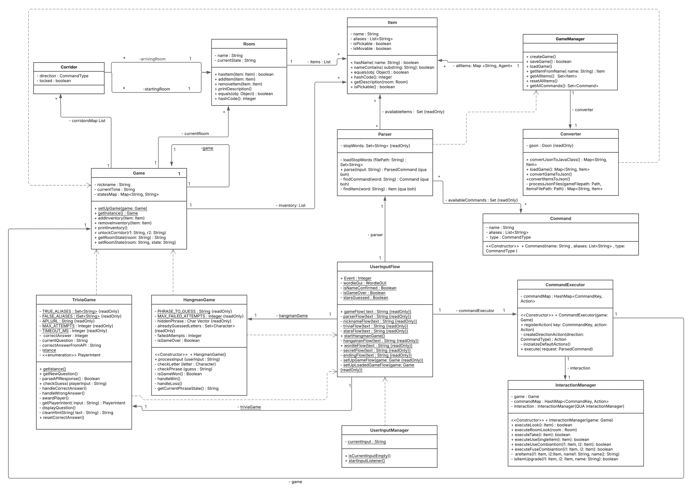
</p>

#### [Ritorna all'Indice](#indice)

---

## Specifiche Algebriche  
Di seguito viene riportata la specifica algebrica di due strutture dati largamente utilizzate all'interno del progetto, la lista e la map.  
Ogni specifica algebrica si articola in: specifica sintattica, semantica e di restrizione.

### Lista
La lista è una struttura dati sequenziale che consente di salvare e accedere a elementi attraverso il loro indice di posizione.
### Lista - Specifica Sintattica
#### Tipi (sorts):
`List`, `Item`, `Integer`, `Boolean`

#### Operatori:
`newList() → List` : crea una lista inizialmente vuota  
`isEmpty(List) → Boolean` : verifica se la lista è vuota  
`getItem(List, Integer) → Item` : ottiene l’elemento in una posizione specifica  
`add(List, Item, Integer) → List` : inserisce un elemento in una data posizione  
`remove(List, Integer) → List` : rimuove l’elemento nella posizione indicata  
`getIndex(List, Item) → Integer` :restituisce la posizione di un elemento  
`getLastIndex(List) → Integer` : ritorna l'ultimo indice occupato  
`contains(List, Item) → Boolean` : controlla se un dato elemento è presente  

**nota**: `Item` rappresenta un tipo generico, che può essere sostituito con qualsiasi altro tipo di dato.  
`Integer` e `Boolean`, invece, sono tipi ausiliari alla definizione della specifica algebrica della lista.

#### Costruttori e Osservazioni:

| Osservazioni | Costruttore: `newList()` | Costruttore: `add(l, it, id)` |
|----------|-------------------------|----------------------------------|
| `isEmpty(l')` | `true` | `false` |
| `getItem(l', id')` | `error` | if `id = id'` then `it` else `getItem(l, id')` |
| `remove(l', id')` | `error` | if `id = id'` then `l` else `add(remove(l, id'), it)` |
| `getIndex(l', it')` | `error` | if `it = it'` then `id` else `getIndex(l, it')` |
| `getLastIndex(l')` | `error` | if `isEmpty(l)` then `1` else `getLastIndex(l) + 1` |
| `contains(l', it')` | `false` | if `it = it'` then `true` else `contains(l, it')` |


### Lista - Specifica semantica

#### Dichiarazioni:

```
l, l' : List  
it, it' : Item  
id, id' : Integer
```

#### Regole semantiche:

- `isEmpty(newList) = true`
- `isEmpty(add(l, it, id)) = false`
- `getItem(add(l, it, id), id') = if id = id' then it else getItem(l, id')`
- `remove(add(l, it, id), id') = if id = id' then l else add(remove(l, id'), it)`
- `getIndex(add(l, it, id), it') = if it = it' then id else getIndex(l, it')`
- `getLastIndex(add(l, it, id)) = if isEmpty(l) then 1 else getLastIndex(l) + 1`
- `contains(newList, it') = false`
- `contains(add(l, it, id), it') = if it = it' then true else contains(l, it')`

### Lista - Specifica di restrizione

#### Restrictions:
- `getItem(newList, id') = error`
- `remove(newList, id') = error`
- `getIndex(newList, it') = error`
- `getLastIndex(newList) = error`

---

### Map
Una map è una collection che consente di creare una **associazione chiave-valore**.

### Map - Specifica Sintattica

#### Tipi (sorts):
`Map`, `Key`, `Value`, `Boolean`

#### Operatori:
`newMap() → Map` : crea una nuova Map  
`isEmpty(Map) → Boolean` : restituisce ```true``` se la Map è vuota, ```false``` altrimenti  
`put(Map, Key, Value) → Map` : inserisce l'elemento ```<Key,Value>``` nella Map  
`get(Map, Key) → Value` : restituisce l'oggetto associato alla chiave ```Key```  
`containsKey(Map, Key) → Boolean` : restituisce ```true``` se la Map contiene la chiave ```Key```, falso altrimenti  
`containsValue(Map, Value) → Boolean` : restituisce ```true``` se la Map contiene il valore ```Value```  
`remove(Map, Key) → Map` : rimuove la coppia chiave-valore associata a ```Key```  

#### Costruttori e Osservazioni:

|Osservazioni | Costruttore: `newMap()` | Costruttore : `put(m, k, v)` |
|----------|-------------------------|----------------------------------|
| `isEmpty(m')` | `true` | `false` |
| `get(m’, k’)` | `error` | if `k’=k` then `v` else `get(m, k’)` |
| `containsKey(m’, k’)` | `false` | if `k’=k` then `true` else `containsKey(m, k’)` |
| `containsValue(m’, v’)` | `false` | if `v’=v` then `true` else `containsValue(m,v')` |
| `remove(m’, k’) ` | `error` | if `k’=k` then `m` else `put(remove(m, k'), k, v)` |

### Map - Specifica Semantica

#### Dichiarazioni:
```
m , m' : Map
k , k' : Key 
v , v' : Value
```

#### Regole semantiche:
- `isEmpty(newMap()) = true`
- `isEmpty(put(m, k, v)) = false`
- `get(put(m, k, v), k’) = if k’ = k then v else get(m, k’)`
- `containsKey(newMap(), k’) = false`
- `containsKey(put(m, k, v), k’) = if k’ = k then true else containsKey(m, k’)`
- `containsValue(newMap(), v’) = false`
- `containsValue(put(m, k, v), v’) = if v’ = v then true else containsValue(m,v')`
- `remove(put(m, k, v), k’) = if k’ = k then m else put(remove(m,k’),k,v)`

### Map - Specifica di restrizione
#### Restrictions:
- `get(newMap(), k’) = error`
- `remove(newMap(),k’) = error`


#### [Ritorna all'Indice](#indice)

---

## Dettagli Implementativi
In questa sezione verrà approfondito il modo in cui i vari argomenti del corso sono stati applicati all'interno del progetto, spiegando come sono stati implementati e a quali funzionalità corrispondono nel codice. Saranno mostrati anche alcuni estratti di codice tratti dal progetto, utilizzati a scopo puramente illustrativo. Si precisa che questi esempi sono stati semplificati per rendere più chiara la spiegazione e potrebbero non rispecchiare fedelmente il codice sorgente completo del gioco.

### File
#### Cosa sono i file?

Un file può essere considerato come una fonte o una destinazione per operazioni di input/output (I/O). In Java, la gestione dei file è resa possibile grazie alla classe `File`, che fornisce metodi utili per creare, eliminare, leggere, scrivere e interagire con i flussi di dati controllati dal sistema operativo.

I flussi possono rappresentare diverse risorse: file memorizzati su disco, dispositivi fisici, applicazioni esterne o strutture in memoria come array. Questi stream possono trattare svariati tipi di dati, dai byte ai caratteri, dai tipi primitivi agli oggetti. Alcuni flussi si limitano a trasmettere dati, mentre altri li trasformano o elaborano. A prescindere dalla loro implementazione, tutti condividono lo stesso modello: l’elaborazione sequenziale di dati.

### Utilizzo dei File nel Progetto

Nel contesto del nostro progetto, i file sono stati utilizzati per diverse finalità: dalla configurazione iniziale del gioco al salvataggio dello stato di avanzamento. Questa gestione ha reso possibile la conservazione delle informazioni di gioco in modo persistente, permettendo agli utenti di riprendere la partita dal punto in cui l'avevano interrotta.

Durante il corso abbiamo inoltre appreso l’utilità del formato **JSON**, che ci ha consentito di archiviare i dati in una struttura ordinata e facilmente interpretabile, semplificandone l’elaborazione e la modifica.

#### Inizializzazione e caricamento del gioco

Per gestire l’avvio e il ripristino del gioco, abbiamo adottato una struttura modulare. In particolare, nella classe `Converter` abbiamo sviluppato un metodo centrale che si occupa di convertire i dati da formato JSON a oggetti Java. Questo metodo è stato pensato per funzionare in entrambi i casi: sia all’avvio di una nuova partita, sia nel caricamento di una sessione salvata precedentemente.


```java
/**
 * metodo che gestisce la conversione dei file JSON in classi Java nel caso di una nuova partita.
 *
 * @return la mappa di tutti gli oggetti (items)
 */
public Map<String, Item> convertJsonToJavaClass() {
    Path gamePath = Paths.get("src/main/resources/static/Game.json");
    Path itemsPath = Paths.get("src/main/resources/static/Items.json");
    return processJsonFiles(gamePath, itemsPath);
}

/**
 * metodo che gestisce la conversione dei file JSON in classi Java nel caso di una partita caricata da un salvataggio.
 *
 * @return la mappa di tutti gli oggetti (items)
 */
public Map<String, Item> loadGame() {
    Path gamePath = Paths.get("src/main/resources/save/SavedGame.json");
    Path itemsPath = Paths.get("src/main/resources/save/SavedItems.json");
    return processJsonFiles(gamePath, itemsPath);
}
```

Per evitare di scrivere due funzioni separate dedicate alla conversione dei dati da JSON a oggetti Java, abbiamo scelto un approccio più flessibile e riutilizzabile. Questo ci ha permesso di ottenere un codice più pulito, organizzato e semplice da aggiornare nel tempo. Il metodo `processJsonFiles` si occupa della lettura dei file JSON ricevuti come argomenti, trasformandoli in una struttura Java — nello specifico, una mappa (`Map`) contenente tutti gli oggetti del gioco. Durante questo processo, viene anche eseguita l'inizializzazione della logica di gioco.

```java
/**
 * converte i file json di una partita e dei suoi oggetti in classi java.
 * restituisce una mappa contenente tutti gli oggetti mappati per nome.
 *
 * @param gameFilePath   il percorso del file della partita
 * @param itemsFilePath  il percorso del file degli oggetti
 * @return la mappa degli oggetti
 */
private Map<String, Item> processJsonFiles(Path gameFilePath, Path itemsFilePath) {
    // usiamo try-with-resources per gestire automaticamente la chiusura dei reader.
    try (
        Reader gameReader = Files.newBufferedReader(gameFilePath, StandardCharsets.UTF_8);
        JsonReader gameJsonReader = new JsonReader(gameReader)
    ) {
        Map<String, Item> allItems = new HashMap<>();
        Map<String, Room> allRooms = new HashMap<>();

        // leggi il file di gioco
        Game game = gson.fromJson(gameJsonReader, Game.class);
        if (game == null) {
            return null;
        }
        
        Game.setUpGame(game);
        
        // mettiamo gli item dell'inventario nella map
        game.getInventory().forEach(item -> allItems.put(item.getName(), item));
        
        // processiamo le stanze e i loro item, garantendo che esista una sola istanza di ogni stanza in memoria!!
        // questo è necessario per evitare problemi di riferimenti incrociati tra stanze e corridoi, dato che 
        // ogni stanza può essere di partenza per un corridoio e di arrivo per un altro, 
        // ma non dobbiamo avere due istanze della stessa stanza in memoria.
        for (Corridor corridor : game.getCorridorsMap()) {
            // gestisci la stanza di partenza
            Room startingRoom = deduplicateRoom(corridor.getStartingRoom(), allRooms, allItems);
            corridor.setStartingRoom(startingRoom);

            // gestisci la stanza di arrivo
            Room arrivingRoom = deduplicateRoom(corridor.getArrivingRoom(), allRooms, allItems);
            corridor.setArrivingRoom(arrivingRoom);
        }

        // assicuriamoci di impostare la stanza corrente con l'istanza corretta dalla mappa
        if (game.getCurrentRoom() != null && allRooms.containsKey(game.getCurrentRoom().getName())) {
            game.setCurrentRoom(allRooms.get(game.getCurrentRoom().getName()));
        }

        // legge il file degli oggetti aggiuntivi
        if (Files.exists(itemsFilePath)) {
            try ( // nidifichiamo il secondo try-with-resources per gestire il file opzionale degli oggetti
                Reader itemsReader = Files.newBufferedReader(itemsFilePath, StandardCharsets.UTF_8);
                JsonReader itemsJsonReader = new JsonReader(itemsReader)
            ) {
                // TypeToken è il modo per comunicare a Gson il tipo generico completo a runtime
                Type itemListType = new TypeToken<ArrayList<Item>>() {}.getType();
                List<Item> itemList = gson.fromJson(itemsJsonReader, itemListType);
                
                // aggiungiamo gli item alla map
                if (itemList != null) {
                    itemList.forEach(item -> allItems.put(item.getName(), item));
                }
            }
        } else {
            return null;
            // se il file degli oggetti non esiste, non continuiamo. deve sempre esistere, al massimo sarà vuoto!!
        }
        
        return allItems;

    } catch (IOException e) {
        throw new UncheckedIOException("errore durante il processamento dei file JSON.", e);
    }
}
```

#### Salvataggio dello stato di gioco

Uno degli aspetti più importanti nella gestione dei file è stato il meccanismo di salvataggio della partita. Anche in questo caso abbiamo optato per il formato JSON, che ha facilitato la memorizzazione ordinata delle informazioni.

A gestire questa funzionalità è la classe `Converter`, all’interno della quale troviamo i metodi `convertGameToJson` e `convertItemsToJson`, responsabili della serializzazione del gioco e dei suoi items nei rispettivi file JSON.

```java
/**
 * converte l'istanza del gioco in un file json per salvare la partita.
 */
public void convertGameToJson() {
    Game game = Game.getInstance();
    String json = gson.toJson(game);

    try {
        // assicurare che la directory di salvataggio esista, o crearla se non esiste
        Path savePath = Paths.get("src/main/resources/save/SavedGame.json");
        Files.createDirectories(savePath.getParent());
        // scrivere il file json
        Files.write(savePath, json.getBytes(StandardCharsets.UTF_8));
    } catch (IOException e) {
        throw new UncheckedIOException("impossibile salvare il file di gioco.", e);
    }
}

/**
 * converte gli oggetti (che non sono nè nell'inventario nè in una stanza, quindi sono ancora da "creare")
 * in un file json per salvare la partita.
 */
public void convertItemsToJson() {
    Game game = Game.getInstance();
    GameManager gameManager = new GameManager();
    Set<Item> allItems = gameManager.getAllItems();

    // raccoglie tutti gli oggetti presenti nel gioco (inventario e stanze) in un unico Set
    Set<Item> itemsInPlay = game.getInventory().stream()
            .collect(Collectors.toSet());
    
    // trova tutti gli oggetti unici che si trovano in tutte le stanze del gioco e li aggiunge a itemsInPlay
    game.getCorridorsMap().stream()
            .flatMap(corridor -> Stream.of(corridor.getStartingRoom(), corridor.getArrivingRoom())) // flatmap per ottenere uno stream di stanze da entrambi i lati del corridoio
            .distinct() // evita di processare la stessa stanza più volte, in base al metodo equals() della classe Room
            .flatMap(room -> room.getItems().stream()) // flatmap genera un unico stream di tutti gli oggetti in tutte le stanze
            .forEach(itemsInPlay::add); // method reference per la lambda: item -> itemsInPlay.add(item)
            // dato che itemsInPlay è un Set, aggiungerà solo elementi unici.

    // filtra la lista completa per trovare solo gli oggetti non in gioco
    Set<Item> itemsToSave = allItems.stream()
            .filter(item -> !itemsInPlay.contains(item))
            .collect(Collectors.toSet());

    String json = gson.toJson(itemsToSave);
    try {
        Path savePath = Paths.get("src/main/resources/save/SavedItems.json");
        Files.createDirectories(savePath.getParent());
        Files.write(savePath, json.getBytes(StandardCharsets.UTF_8));
    } catch (IOException e) {
        throw new UncheckedIOException("impossibile salvare il file degli oggetti.", e);
    }
}
```

#### Inizializzazione delle parole "inutili" (stop words) da file `.txt`

Per caricare le stop words all'interno del programma, abbiamo implementato il metodo `loadStopWords` nella classe `Parser`. Questo metodo legge il contenuto del file `stopwords.txt` e popola una lista contenente tutte le parole da ignorare durante l'elaborazione dell'input utente. Il codice è mostrato qui di seguito:

```java
/**
 * carica le stop words da un file.
 *
 * @param filePath il percorso del file contenente le stop words
 * @return un set di stop words
 */
private Set<String> loadStopWords(String filePath) {
    Set<String> words = new HashSet<>();
    // utilizza la feature try-with-resources di Java per leggere le stop words da un file
    // e gestire automaticamente la chiusura del BufferedReader
    // (il reader viene chiuso in automatico non appena il blocco try termina,
    // sia che termini normalmente, sia che venga lanciata un'eccezione)
    try (BufferedReader reader = new BufferedReader(new FileReader(filePath))) {
        String line;
        while ((line = reader.readLine()) != null) {
            words.add(line.trim().toLowerCase());
        }
    } catch (IOException e) {
        System.err.println("errore durante il caricamento delle stop words: " + e.getMessage());
    }
    return Collections.unmodifiableSet(words);
}
```
L’integrazione dei file nel progetto si è rivelata essenziale per la memorizzazione e il recupero permanente dei dati di gioco, consentendo agli utenti di riprendere la partita esattamente da dove l’avevano lasciata. Questo approccio ha migliorato sia la continuità dell’esperienza utente che la gestione dei dati all’interno del sistema.

Abbiamo scelto di utilizzare file in formato JSON anziché affidarci alla serializzazione tradizionale (tramite `Serializable`) perché offre una rappresentazione più chiara, leggibile e facilmente modificabile. I JSON risultano particolarmente pratici anche per operazioni di debug o aggiornamenti manuali, rispetto ai file binari, che sono meno accessibili e meno intuitivi da gestire.

---

### Database
#### Cos'è un Database?

Un database è un sistema che consente di raccogliere, organizzare e gestire grandi quantità di dati in modo strutturato, permettendo un facile accesso, aggiornamento e gestione delle informazioni.

Uno dei motivi per cui Java ha avuto grande diffusione è la sua capacità di sviluppare applicazioni client/server che funzionano su qualunque sistema operativo, grazie alla sua portabilità. Questa indipendenza dalla piattaforma è importante anche per i software che devono interagire con basi di dati. Per soddisfare questa esigenza, è stato introdotto lo standard **JDBC (Java DataBase Connectivity)**.

#### Come funziona JDBC?

JDBC è stato ideato per offrire compatibilità su qualsiasi piattaforma. Per raggiungere questo scopo, mette a disposizione il **Driver Manager**, un componente che ha il compito di coordinare i vari driver necessari per interagire con i database. Ad esempio, se si utilizzano tre diversi tipi di DBMS, sarà necessario avere a disposizione tre driver differenti, ognuno pensato per funzionare con il proprio sistema.

Quando un driver viene inizializzato, si registra automaticamente presso il Driver Manager.

Come molte delle API fornite da Java, anche JDBC è progettato per rendere più semplici le operazioni frequenti sui database, come la gestione delle connessioni, la creazione delle tabelle, l’esecuzione delle query e la consultazione dei risultati.

### Utilizzo dei Database nel Progetto

Seguendo le indicazioni del docente, abbiamo scelto di utilizzare **H2**, un database open-source scritto interamente in Java. H2 è noto per la sua leggerezza e velocità, ed è compatibile sia con la modalità server che con quella embedded.

Questo DBMS è molto diffuso tra gli sviluppatori Java grazie alla sua semplicità di configurazione e utilizzo, caratteristiche che lo hanno reso ideale per il nostro progetto. Il database ha gestito in modo efficace la conservazione dei dati relativi alle descrizioni del gioco e ai tempi di gioco degli utenti, assicurando la **persistenza delle informazioni** e la possibilità di recuperarle in qualsiasi momento.

Inoltre, uno dei punti di forza di H2 è la presenza di una console web integrata, che permette di visualizzare facilmente il contenuto del database. Questa interfaccia ci è stata utile per controllare i dati salvati e per facilitare il debug, come illustrato nella figura seguente:

<p align="center">
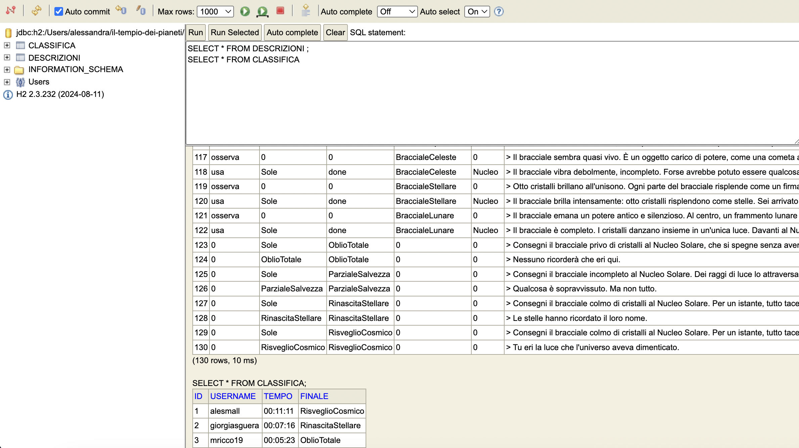
</p>


#### Connessione al DB

Per utilizzare il database, come visto durante il corso, è necessario stabilire una connessione. Per questo abbiamo creato la classe **DatabaseConnection**, incaricata di gestire la connessione al database e di eseguire le operazioni di lettura e scrittura dei dati, come illustrato di seguito:

```java
/**
 * classe che gestisce la connessione al database H2,
 * l'inizializzazione delle tabelle e l'esecuzione di query per ottenere dati.
 */
public class DatabaseConnection {

    static final String JDBC_DRIVER = "org.h2.Driver";
    static final String DB_URL = "jdbc:h2:./src/main/resources/database/il_tempio_dei_pianeti";
    static final String USER = "aaaa";
    static final String PASS = "1111";
```
Nella classe **DatabaseConnection** sono definite le costanti fondamentali come il driver JDBC, l'URL del database, l'username e la password necessari per la connessione.

La classe include inoltre i metodi che permettono di aprire la connessione, creare le tabelle, inserire i dati e leggerli, come riportato di seguito:

```java
public static Connection connect() {
    PreparedStatement stmt = null;
    ResultSet rs = null;
    String start = "RUNSCRIPT FROM 'src/main/resources/database/db_start.sql'";
    String fill = "RUNSCRIPT FROM 'src/main/resources/database/db_info.sql'";
    boolean emptyClassifica = true;
    boolean emptyDescr = true;
    try {
        Class.forName(JDBC_DRIVER);
    } catch (ClassNotFoundException e) {
        throw new RuntimeException(e);
    }
    try {
         Connection conn = DriverManager.getConnection(DB_URL, USER, PASS);
         stmt = conn.prepareStatement(start);
         stmt.execute();
         stmt.close();

         String sql = "SELECT * FROM CLASSIFICA";
         stmt = conn.prepareStatement(sql);
         rs = stmt.executeQuery();
         while (rs.next()) {
             emptyClassifica = false;
         }
         rs.close();
         String sql2 = "SELECT * FROM DESCRIZIONI";
         stmt = conn.prepareStatement(sql2);
         rs = stmt.executeQuery();
         while (rs.next()) {
             emptyDescr = false;
         }
         rs.close();

         if (emptyClassifica && emptyDescr) {
             stmt = conn.prepareStatement(fill);
             stmt.execute();
             stmt.close();
         }

         return conn;
    } catch (SQLException e) {
        throw new RuntimeException(e);
    }
}
```

Il metodo **connect** si occupa di aprire la connessione al database, creare le tabelle necessarie e controllare se sono vuote. Quando richiesto, inserisce i dati di default nelle tabelle e restituisce la connessione attiva.

Altri metodi chiave includono **close**, **printFromDB** e **getDescriptionFromDB**, che rispettivamente permettono di chiudere la connessione, aggiungere dati al database, mostrare i dati salvati, ottenere la classifica dei giocatori e recuperare le descrizioni delle stanze. Procediamo ad esaminarli nel dettaglio:
```java
/**
 * chiude la connessione al database.
 *
 * @param conn la connessione da chiudere
 */
public static void close(Connection conn) {
    if (conn != null) {
        try {
            conn.close();
        } catch (SQLException e) {
            throw new RuntimeException(e);
        }
    }
}
```

```java
/**
 * stampa una descrizione dal database in base ai parametri forniti.
 *
 * @param idComando     l'id del comando
 * @param idStanza      l'id della stanza
 * @param idStato       l'id dello stato
 * @param idItem1       l'id del primo oggetto
 * @param idItem2       l'id del secondo oggetto
 */
public static void printFromDB(String idComando, String idStanza, String idStato, String idItem1, String idItem2) {
    Connection conn;
    conn = DatabaseConnection.connect();
    String sql_query = "SELECT DESCRIZIONE FROM DESCRIZIONI WHERE COMANDO = '" + idComando + "' AND STANZA = '" + idStanza + "' AND STATO = '" + idStato + "' AND ITEM1 = '" + idItem1 + "' AND ITEM2 = '" + idItem2 + "'";
    OutputDisplayManager.displayText(DatabaseConnection.getDescriptionFromDB(conn, sql_query));
    DatabaseConnection.close(conn);
}
```

```java
/**
 * restituisce la descrizione dal database.
 *
 * @param conn la connessione al database
 * @param sql_query la query SQL
 * @return la descrizione ottenuta dal database
 */
public static String getDescriptionFromDB(Connection conn, String sql_query) {
    try {
        Statement stmt = conn.createStatement();
        ResultSet rs = stmt.executeQuery(sql_query);
        if (rs.next()) {
            return rs.getString("DESCRIZIONE");
        }
        rs.close();
        stmt.close();
    } catch (SQLException e) {
        throw new RuntimeException(e);
    }
    return "nessuna descrizione trovata :(";
}
```
Il metodo **printFromDB** ha il compito di stampare la descrizione della stanza attuale, recuperandola dal database in base ai parametri forniti.

Il metodo **getDescriptionFromDB**, invece, esegue una query SQL ricevuta come parametro e restituisce la descrizione corrispondente alla stanza corrente.

In sintesi, l'impiego del database ci ha offerto una soluzione pratica ed efficace per salvare e recuperare i dialoghi del gioco, oltre a gestire la classifica relativa ai tempi di gioco.

---

### Lambda Expressions 

#### Cosa sono le Lambda Expressions?
Le *lambda expressions* sono una funzionalità introdotta con Java 8, pensata per semplificare e rendere più espressivo il codice. Si tratta di un costrutto della programmazione funzionale che consente di trattare le funzioni come oggetti di prima classe.
In pratica, una lambda consente di definire in modo conciso un blocco di codice che può essere passato come parametro a metodi, come accade ad esempio con funzioni di ordinamento, filtraggio o esecuzione differita.

#### Caratteristiche principali
Una lambda expression è composta da tre elementi:
- **Parametri**: specificati tra parentesi tonde. Se è presente un solo parametro e il tipo è deducibile, si possono omettere le parentesi.
- **Operatore `->`**: separa i parametri dal corpo della lambda.
- **Corpo**: può essere un’unica espressione o un blocco di istruzioni racchiuso tra `{}`. Se non viene restituito nulla (tipo `void`), si possono omettere le parentesi.

### Utilizzo delle Lambda Expressions nel Progetto

Abbiamo utilizzato le lambda expressions per l'implementazione dei comportamenti dei comandi, in modo tale da semplificare il codice e renderlo più leggibile. Infatti, per gestire i comandi all'interno del gioco, abbiamo utilizzato una mappa di comandi, in cui ad ogni tipo comando è associata una lambda expression che ne definisce il comportamento.

```java
public class CommandExecutor {

    private Game game;
    private HashMap<CommandKey, Action> commandMap;
    private InteractionManager interaction;

    /**
     * istanzia una mappa di tutti i comandi e i loro comportamenti/azioni.
     *
     * @param game l'istanza del gioco
     */
    public CommandExecutor(Game game) {
        this.game = game;
        this.interaction = new InteractionManager(game);
        commandMap = new HashMap<>();

        initializeDefaultActions();
    }

    /**
     * inizializza le azioni predefinite per i comandi del gioco.
     * registra i comandi di movimento, osservazione, aiuto, inventario,
     * presa, rilascio, uso e fusione degli oggetti.
     */
    private void initializeDefaultActions() {
        // comando per stampare l'aiuto
        registerAction(new CommandKey(CommandType.AIUTO, 0),
                _ -> {
                    OutputDisplayManager.displayText("> Comandi disponibili:");
                    GameManager gameManager = new GameManager();
                    Set<Command> commands = gameManager.getAllCommands();
                    commands.forEach(c -> OutputDisplayManager.displayText(">  - " + c.getName()));
                    OutputDisplayManager.displayText("> (per ulteriori informazioni utilizza la guida in alto)"); 
                }
        );
        // altri comandi...
```
Vediamo come esempio di queste implementazioni il comando "AIUTO". Il metodo `registerAction` prende in input una chiave di tipo `CommandKey`, composta dal tipo di comando e dal numero di parametri, e un'azione di tipo `Action`. Infatti, per l'esecuzione della lambda expression abbiamo definito un'interfaccia funzionale `Action` che contiene un metodo execute che prende in input un oggetto di tipo ParsedCommand e non restituisce nulla. In questo caso, l'input è nullo (_), in quanto per eseguire il comando di aiuto non è necessario alcun input. Action è un'interfaccia funzionale, con execute come unico metodo astratto. Questo rende possibile l'utilizzo di lambda expressions per implementare il comportamento di un comando specifico: utilizzare, al posto di un parametro di tipo Action, l'espressione lambda: p -> game.doSomething() vuol dire "creare un oggetto che implementa l'interfaccia Action, il cui metodo execute prende come parametro p e al suo interno esegue game.doSomething()".

#### Elenco dei Comandi Implementati (tramite Lambda)

- **AIUTO**  
  Mostra l’elenco di tutti i comandi disponibili.

- **OSSERVA**  
  - Senza argomenti: descrive la stanza in cui si trova il giocatore.  
  - Con un argomento: fornisce informazioni dettagliate sull’oggetto specificato.

- **INVENTARIO**  
  Mostra tutti gli oggetti attualmente in possesso del giocatore.

- **PRENDI**  
  Consente di raccogliere un oggetto e aggiungerlo all’inventario.

- **LASCIA**  
  Permette di rimuovere un oggetto dall’inventario e lasciarlo nella stanza.

- **USA**  
  - Con un argomento: permette di utilizzare un oggetto.  
  - Con due argomenti: permette di utilizzare il primo oggetto sul secondo.

- **UNISCI**  
  Unisce due oggetti per generarne uno nuovo.

- **NORD / EST / SUD / OVEST**  
  Gestiscono il movimento del giocatore tra le stanze. Questi comandi sono gestiti da un’unica lambda generalizzata, parametrizzata sulla direzione.

Oltre alla gestione dei comandi, anche una parte del parsing dell'input dell'utente è stata implementata utilizzando le espressioni lambda. In particolare, le lambda sono utilizzate per:
- **Suddividere l'input** in singole parole (split),
- **Rimuovere automaticamente le stop words**, ossia le parole non significative ai fini dell’analisi,
- **Effettuare il match tra le parole inserite dall’utente e i set di alias** definiti per oggetti, comandi e personaggi.

Di seguito è riportato il frammento di codice che gestisce questa logica:
```java
public class Parser {

    private final Set<Command> availableCommands;
    private final Set<Item> availableItems;
    private final Set<String> stopWords;

    // ...

    /**
     * esegue il parsing di una stringa di input.
     * @param input la stringa inserita dall'utente
     * @return un oggetto ParsedCommand con il risultato del parsing
     */
    public ParsedCommand parse(String input) {
        Item item1 = null;
        Item item2 = null;

        if (input == null || input.trim().isEmpty()) {
            return new ParsedCommand(null, null, null);
        }

        // divide l'input in parole, rimuove le stop words e converte in minuscolo
        List<String> words = Arrays.stream(input.trim().toLowerCase().split("\\s+"))
                .filter(word -> !stopWords.contains(word))
                .collect(Collectors.toList());

        // se non ci sono parole, ritorna un comando nullo
        if (words.size() == 0) {
            return new ParsedCommand(null, null, null);
        }

        // trova il comando corrispondente alla prima parola
        Command foundCommand = findCommand(words.get(0));
        if (foundCommand == null) {
            return new ParsedCommand(null, null, null);
        }

        if (words.size() > 1) {
            if (findItem(words.get(1)) != null) {
                item1 = findItem(words.get(1));
            } else {
                return new ParsedCommand(null, null, null); // se c'è una parola dopo il comando ma quella parola non è un oggetto valido, tutto il comando diventa null
            }
        }
        if (words.size() > 2) {
            if (findItem(words.get(1)) != null) {
                item2 = findItem(words.get(2));
            } else {
                return new ParsedCommand(null, null, null);
            }
        }

        return new ParsedCommand(foundCommand.getCommandType(), item1, item2);
    }

    /**
     * trova un comando dato un nome o un alias.
     * @param word la parola da cercare
     * @return il Command trovato o null
     */
    private Command findCommand(String word) {
        return availableCommands.stream()
                .filter(command -> 
                    // controlla il nome principale (case-insensitive)
                    command.getName().equalsIgnoreCase(word) ||
                    // o controlla se qualsiasi alias corrisponde (case-insensitive)
                    command.getAliases().stream().anyMatch(alias -> alias.equalsIgnoreCase(word))
                )
                .findFirst()
                .orElse(null);
    }

    /**
     * trova un oggetto dato un nome o un alias.
     * @param word la parola da cercare
     * @return l'Item trovato o null
     */
    private Item findItem(String word) {
        return availableItems.stream()
                .filter(item -> 
                    item.getName().equalsIgnoreCase(word) ||
                    item.getAliases().stream().anyMatch(alias -> alias.equalsIgnoreCase(word))
                )
                .findFirst()
                .orElse(null);
    }
}
```
Nel processo di parsing dell’input dell’utente, sono state utilizzate **lambda expressions** per rendere il codice più compatto e funzionale. In particolare, due lambda svolgono un ruolo centrale:

- **Prima lambda expression:** per la creazione di List< String > words  
  Questa lambda prende la stringa inserita dall’utente e la:
  1. Suddivide in un array di parole (`split`),
  2. Converte ogni parola in minuscolo (`lowercase`),
  3. Filtra le parole non significative (le cosiddette **stop words**),
  4. Restituisce il risultato come lista di stringhe filtrata.

- **Seconda lambda expression:** per le funzioni findCommand e findItem  
  Questa lambda viene utilizzata per confrontare l’input con il **nome** o i **nomi alternativi (alias)** associati a un determinato oggetto o comando. Se viene trovata una corrispondenza (case-insensitive), il risultato corrispondente viene impostato nel `ParserOutput`.

#### Conversione tra JSON e Oggetti Java tramite Lambda Expressions

Le **lambda expressions** sono state utilizzate anche nella fase di serializzazione e deserializzazione, ovvero nella **conversione tra file JSON e oggetti Java**, in due scenari principali:
1. **Avvio di una nuova partita:**  
   I componenti principali del gioco (oggetti, ambienti, ecc.) vengono istanziati a partire dai file JSON base.
2. **Caricamento di una partita salvata:**  
   Gli stessi elementi vengono ricostruiti leggendo i file JSON di salvataggio, riportando il gioco all’esatto stato in cui si trovava l’utente.
Allo stesso modo, quando il giocatore sceglie di **salvare la partita**, viene effettuata la conversione inversa: gli oggetti presenti in memoria vengono convertiti in formato JSON e scritti su file.
Queste operazioni sono state semplificate tramite l’uso di lambda expressions, che hanno permesso di ridurre il boilerplate e gestire in modo funzionale la logica di parsing e scrittura.

```java
public class Converter {

    // ...

    /**
     * converte gli oggetti (che non sono nè nell'inventario nè in una stanza, quindi sono ancora da "creare")
     * in un file json per salvare la partita.
     */
    public void convertItemsToJson() {
        Game game = Game.getInstance();
        GameManager gameManager = new GameManager();
        Set<Item> allItems = gameManager.getAllItems();

        // raccoglie tutti gli oggetti presenti nel gioco (inventario e stanze) in un unico Set
        Set<Item> itemsInPlay = game.getInventory().stream()
                .collect(Collectors.toSet());
        
        // trova tutti gli oggetti unici che si trovano in tutte le stanze del gioco e li aggiunge a itemsInPlay
        game.getCorridorsMap().stream()
                .flatMap(corridor -> Stream.of(corridor.getStartingRoom(), corridor.getArrivingRoom())) // flatmap per ottenere uno stream di stanze da entrambi i lati del corridoio
                .distinct() // evita di processare la stessa stanza più volte, in base al metodo equals() della classe Room
                .flatMap(room -> room.getItems().stream()) // flatmap genera un unico stream di tutti gli oggetti in tutte le stanze
                .forEach(itemsInPlay::add); // method reference per la lambda: item -> itemsInPlay.add(item)
                // dato che itemsInPlay è un Set, aggiungerà solo elementi unici.

        // filtra la lista completa per trovare solo gli oggetti non in gioco
        Set<Item> itemsToSave = allItems.stream()
                .filter(item -> !itemsInPlay.contains(item))
                .collect(Collectors.toSet());

        String json = gson.toJson(itemsToSave);
        try {
            Path savePath = Paths.get("src/main/resources/save/SavedItems.json");
            Files.createDirectories(savePath.getParent());
            Files.write(savePath, json.getBytes(StandardCharsets.UTF_8));
        } catch (IOException e) {
            throw new UncheckedIOException("impossibile salvare il file degli oggetti.", e);
        }
    }
    
    // ...
```
Il metodo `convertItemsToJson` entra in gioco durante il **salvataggio dello stato del gioco**.
- Viene generato un `Set` di oggetti (`Item`) **non contenuti nell’inventario** né **presenti nelle stanze** (quindi potenzialmente ancora "non raccolti").
- Tutte queste informazioni vengono infine **serializzate in formato JSON** e scritte su file.
Le lambda expressions vengono utilizzate per semplificare il filtraggio, il controllo delle condizioni e la trasformazione dei dati prima della scrittura.

#### Metodo `processJsonFiles` e `deduplicateRoom`
Il metodo `processJsonFiles` ha il compito di leggere i file JSON contenenti tutte le informazioni del gioco e di creare, a partire da essi, le **stanze** e gli **oggetti** del gioco.  
Per evitare **duplicazioni** durante il parsing:
- Viene verificata l’esistenza della stanza all’interno della lista globale delle stanze tramite una lambda expression.
- Se **non è presente**, i suoi oggetti vengono aggiunti alla mappa di tutti gli oggetti, e la stanza viene aggiunta alla lista.
- Se **è già presente**, viene riutilizzata la copia esistente già istanziata.
In questo modo si mantiene la coerenza delle istanze nel gioco e si evita la duplicazione in memoria.

```java
/**
 * metodo helper per deduplicare le stanze e processare i loro oggetti.
 *
 * @param room la stanza da processare, potenzialmente una nuova istanza da deserializzazione
 * @param allRooms la mappa di tutte le stanze uniche trovate finora
 * @param allItems la mappa di tutti gli oggetti trovati finora
 * @return l'istanza unica della stanza (o una nuova se non ancora vista)
 */
private Room deduplicateRoom(Room room, Map<String, Room> allRooms, Map<String, Item> allItems) {
    if (room == null) {
        return null;
    }
    
    if (!allRooms.containsKey(room.getName())) {
        // è la prima volta che vediamo questa stanza, la aggiungiamo alla mappa
        // e mettiamo i suoi oggetti nella mappa globale degli oggetti.
        allRooms.put(room.getName(), room);
        room.getItems().forEach(item -> allItems.put(item.getName(), item));
        return room;
    } else {
        // se la stanza esiste già, aggiorniamo il corridoio con l'istanza esistente
        return allRooms.get(room.getName());
    }
}
```

L'uso delle **lambda expressions** all'interno del progetto ha migliorato in modo significativo la **leggibilità** e la **manutenibilità** del codice, in particolare in:
- Gestione dei **comandi di gioco**,
- Parsing dell’**input dell’utente**,
- Serializzazione e deserializzazione dei dati di gioco,
- Manipolazione di **collezioni** (filtri, trasformazioni, controlli).

---

### SWING 

#### Cos'è Java Swing?
**Java Swing** è un framework per lo sviluppo di interfacce grafiche (GUI) in ambiente Java. Introdotto con Java 1.2, ha sostituito il precedente toolkit AWT (Abstract Window Toolkit), offrendo un set di componenti grafici molto più flessibile, estensibile e indipendente dal sistema operativo.
Swing consente di creare applicazioni desktop con interfacce moderne e interattive, grazie a una vasta gamma di componenti tra cui:
- **Finestre** (`JFrame`), **Form**, **Dialog**
- **Pulsanti**, **Checkbox**, **ComboBox**, **Menu**
- **Tabelle** (`JTable`), **Alberi** (`JTree`)
- **Layout personalizzabili**
- Supporto per **Look & Feel** personalizzati

### Utilizzo di SWING nel Progetto
Nel nostro gioco, l’intera interfaccia grafica è stata sviluppata utilizzando **Java Swing**, con l'obiettivo di creare un’esperienza visivamente ricca e coinvolgente per l’utente.
La struttura dell’interfaccia si basa su un **unico `JFrame` principale**, che ospita tutti i componenti interattivi tramite l’utilizzo di:
- **`JPanel`** per organizzare le varie schermate e sezioni
- **`CardLayout`** per gestire dinamicamente il passaggio da una schermata all’altra (es. menu, gioco, ecc.).

#### Vantaggi dell'approccio usato
L’utilizzo di `CardLayout` ci ha permesso di costruire una GUI:
- **Dinamica**, in grado di cambiare schermata senza creare nuove finestre
- **Modulare**, rendendo più semplice l’aggiunta di nuove sezioni in futuro
- **Manutenibile**, evitando modifiche invasive al codice esistente

#### Gestione della GUI nel Codice
La classe principale che gestisce l’interfaccia grafica si chiama **`ManagerGUI`**, e si occupa di:
- Estendere `JFrame` per fungere da finestra principale
- Inizializzare tutti i componenti grafici necessari
- Coordinare le varie schermate (`JPanel`) attraverso `CardLayout`
- Gestire gli eventi e le interazioni utente

Questa organizzazione ci ha permesso di mantenere una struttura chiara e coerente durante tutto lo sviluppo dell’interfaccia.
```java
/**
 * classe che gestisce le GUI.
 */
public class ManagerGUI extends JFrame {
    static GameGUI game;

    /**
     * istanzia un nuovo gestore della GUI.
     */
    public ManagerGUI() {
        // imposta le proprietà del frame
        setDefaultCloseOperation(WindowConstants.EXIT_ON_CLOSE);
        setTitle("Il Tempio dei Pianeti");
        setPreferredSize(new Dimension(800, 600));
        setResizable(false);
        try {
            Image icon = ImageIO.read(new File("src/main/resources/img/icon.png"));
            setIconImage(icon);
        } catch (IOException e) {
            e.printStackTrace();
        }

        // inizializza la musica
        Mixer music = Mixer.getInstance();

        // crea i pannelli delle schermate
        JPanel cards = new JPanel(new CardLayout());
        MenuGUI menu = new MenuGUI();
        CreditsGUI credits = new CreditsGUI();
        ProgressBarGUI progressBar = new ProgressBarGUI();
        game = new GameGUI();

        // aggiunge i pannelli al contenitore cards
        cards.add(menu, "MenuGUI");
        cards.add(progressBar, "ProgressBarGUI");
        cards.add(game, "GameGUI");
        cards.add(credits, "CreditsGUI");

        // avvia il frame
        add(cards);
        pack();
        setLocationRelativeTo(null);
        setVisible(true);

        // avvia la musica
        music.start();
    }

    //...
}
```
La classe `ManagerGUI` è il punto centrale della gestione grafica del nostro gioco. Essa estende `JFrame` e rappresenta la **finestra principale** dell’applicazione.
- Contiene un **costruttore** e un solo metodo aggiuntivo.
- All’interno del **costruttore** vengono inizializzate:
  - Le proprietà del `JFrame` (dimensioni, visibilità, comportamento alla chiusura, ecc.)
  - I vari `JPanel` che compongono la GUI del gioco
- I `JPanel` vengono aggiunti a un **`CardLayout`**, che consente di navigare tra le diverse schermate in modo **fluido** e **intuitivo**.

#### Il Menù Principale
All'avvio dell'applicazione, la prima schermata visibile è il **menu principale**. Questo è gestito dalla classe `MenuGUI`, che estende `JPanel` e contiene tutti i componenti interattivi della schermata iniziale.

Il menù fornisce pulsanti per le seguenti azioni:
- **avviare una nuova partita**
- **caricare una partita salvata**
- **visualizzare i crediti**
- **aprire il sito web del gioco** '🌐'
- **attivare/disattivare la musica di sottofondo** '🔊'
- **aprire il manuale utente** '?'

<p align="center">
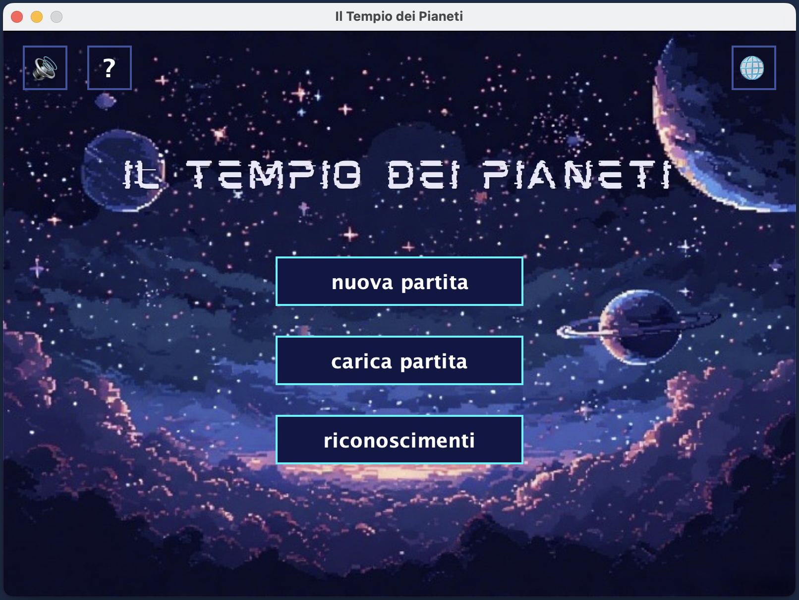
</p>

#### Struttura della Classe `MenuGUI`
- Estende `JPanel`
- Inizializza tutti i **componenti grafici** del menu
- Gestisce gli **eventi** associati ai pulsanti tramite action listener
- È progettata per integrarsi perfettamente con il `CardLayout` della `ManagerGUI`

```java
public class MenuGUI extends JPanel {

    private static final Color COLORE_SFONDO_PULSANTI = new Color(17, 24, 68, 200); 
    private static final Color COLORE_BORDO_PULSANTI = new Color(0, 246, 255);   
    private static final Color COLORE_BORDO_ICONA = new Color(63,84,158); 
    private static final Color COLORE_TESTO_PULSANTI = Color.WHITE;
    private static final Color COLORE_HOVER_PULSANTI = new Color(30, 50, 110, 220); 
    private static final Font FONT_PULSANTI_PRINCIPALI = new Font("Dialog", Font.BOLD, 20);
    private static final Font FONT_PULSANTI_ICONA = new Font("Dialog", Font.BOLD, 25);
    
    private static JButton soundButton;
    private final Image immagineSfondo;
    private final GameManager gameManager = new GameManager();

    /**
     * costruttore della classe.
     */
    public MenuGUI() {
        this.immagineSfondo = new ImageIcon("src/main/resources/img/menuBackground.png").getImage();
        initComponents();
    }

    /**
     * inizializza e assembla i componenti grafici della schermata.
     */
    private void initComponents() {
        //...
    }
 ```

La classe `MenuGUI` rappresenta il **menu iniziale** dell’applicazione, ovvero la prima schermata visibile all’avvio del gioco. Estende `JPanel` ed è progettata per interagire perfettamente con il `CardLayout` di `ManagerGUI`.

All'interno della classe troviamo:
- **`backgroundPanel`**: un pannello dedicato al disegno dello sfondo grafico del menu, un'immagine personalizzata.
- **Pulsanti principali**:
  - `newGame`: avvia una nuova partita
  - `loadGame`: carica una partita salvata
  - `sound`: attiva/disattiva la musica di sottofondo
  - `help`: mostra le istruzioni di gioco
  - `site`: apre la pagina html collegata al gioco
  - `credits`: visualizza le informazioni sul team di sviluppo

Il costruttore di `MenuGUI` richiama il metodo `initComponents()`, che ha il compito di configurare la grafica e il comportamento dei componenti.

Le principali operazioni effettuate dal metodo `initComponents()` sono:
- Impostazione del **pannello di sfondo** con immagine personalizzata
- Creazione e posizionamento dei pulsanti, con dimensioni e testi specifici
- Aggiunta di **`ActionListener`** a ciascun pulsante per gestire le interazioni dell’utente

#### Caricamento e Avvio della Partita
Quando l’utente clicca su:
- **"nuova partita"**
- **"carica partita"**
  
il menù attiva la schermata successiva nel `CardLayout`, ovvero il pannello della **ProgressBar**.

<p align="center">
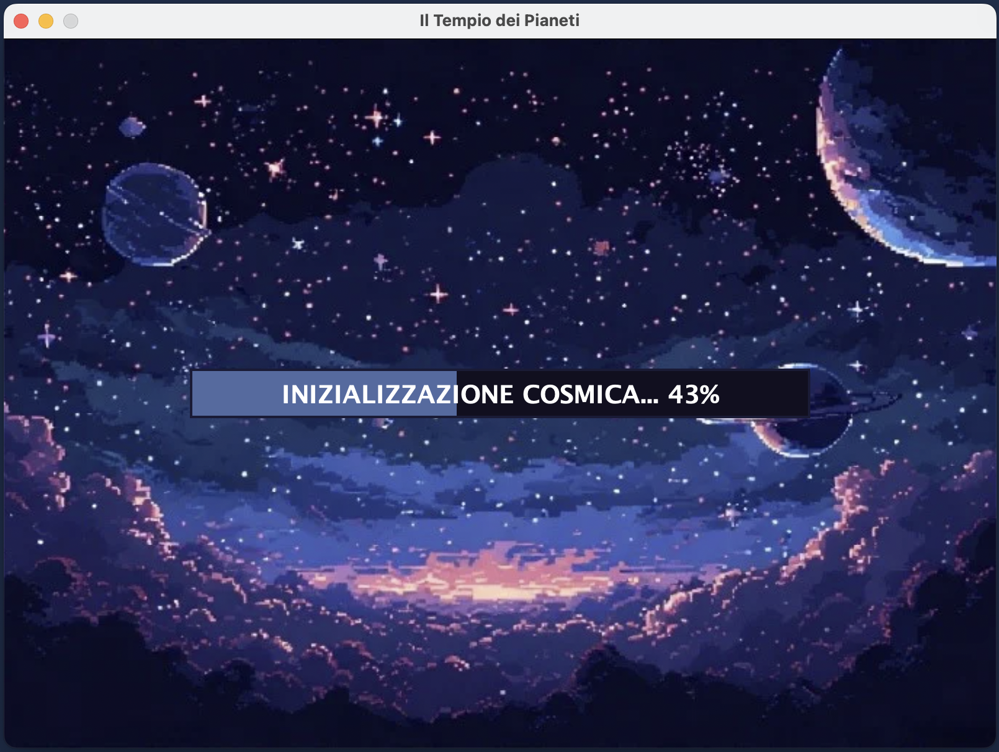
</p>

La barra di caricamento è stata realizzata tramite la classe `ProgressBarGUI`, la quale estende `JPanel` e include tutti i componenti grafici necessari.

```java
public class ProgressBarGUI extends JPanel {
    /**
     * costruttore della classe.
     */
    public ProgressBarGUI() {
        this.support = new PropertyChangeSupport(this);
        // carica l'immagine di sfondo una sola volta per efficienza
        this.background = new ImageIcon("src/main/resources/img/progressBarBackground.png").getImage(); 
        initComponents();
    }

    /**
     * avvia l'animazione della barra di avanzamento.
     */
    public void startProgressBar() {
        // usa un timer per aggiornare la barra a intervalli regolari
        Timer timer = new Timer();
        TimerTask task = new TimerTask() {
            private int counter = 0;
            @Override
            public void run() {
                if (counter <= 100) {
                    progressBar.setValue(counter);
                    progressBarLabel.setText("INIZIALIZZAZIONE COSMICA... " + counter + "%");
                    counter++;
                } else {
                    // caricamento completato
                    progressBarLabel.setText("IL TEMPIO SI È RISVEGLIATO !!");
                    // attendi un breve istante prima di notificare il completamento
                    new Timer().schedule(new TimerTask() {
                        @Override
                        public void run() {
                            setFinished(true);
                        }
                    }, 1000);
                    // ferma il timer 
                    timer.cancel();
                }
            }
        };
        // esegue il task ogni 35 millisecondi per un'animazione fluida
        timer.scheduleAtFixedRate(task, 0, 35);
    }
```
Il metodo `startProgressBar` viene utilizzato per avviare la barra di caricamento nella schermata iniziale del gioco, offrendo all’utente un’indicazione visiva sullo stato di avanzamento.

Una volta terminato il caricamento, la schermata viene chiusa automaticamente e l’utente viene reindirizzato all’interfaccia principale del gioco, pronto per iniziare la partita.

<p align="center">
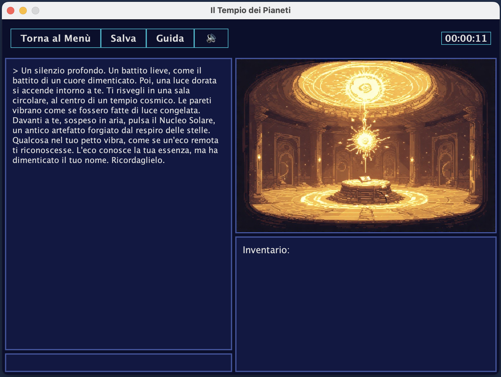
</p>

La gestione della schermata di gioco è affidata alla classe `GameGUI`, che estende `JPanel` e racchiude al suo interno tutti gli elementi grafici necessari al gameplay.
```java
public class GameGUI extends JPanel {
    // ...

    // array con i nomi delle immagini delle stanze per il caricamento dinamico
    private static final String[] NOMI_STANZE = {
        "Sole", "Luna", "Mercurio", "Venere", "Terra", "Marte", "Giove", "Saturno", "Urano", "Nettuno",
        "StanzaMV", "StanzaMU", "StanzaGSN", "OblioTotale", "ParzialeSalvezza", "RinascitaStellare", "RisveglioCosmico"
    };

    private static JLabel timerLabel;
    private static JPanel imagePanel;
    private static JTextPane displayTextPane;
    private static JTextArea inventoryTextArea;
    private static JButton musicButton;
    private static CardLayout cardLayout;
    private JTextField userInputField;
    private final Map<String, Image> imageCache = new HashMap<>();

    /**
     * costruttore della classe GameGUI.
     */
    public GameGUI() {
        UIManager.put("ToolTip.background", COLORE_SFONDO_PANNELLO); 
        UIManager.put("ToolTip.foreground", COLORE_TESTO_PRINCIPALE);
        UIManager.put("ToolTip.border", BorderFactory.createLineBorder(COLORE_BORDO));
        initComponents();
    }
    
    /**
     * inizializza e assembla tutti i componenti della GUI.
     */
    private void initComponents() {
        setLayout(new BorderLayout(5, 5));
        setBackground(COLORE_SFONDO_PANNELLO);
        setPreferredSize(new Dimension(800, 600));
        setBorder(BorderFactory.createEmptyBorder(5, 5, 5, 5));

        // aggiunge i pannelli principali al layout
        add(createToolBar(), BorderLayout.NORTH);
        add(createMainDisplayPanel(), BorderLayout.CENTER);
        add(createSidePanel(), BorderLayout.EAST);
    }

    // ...
```
Come per `MenuGUI`, anche `GameGUI` funge da pannello principale del gioco, includendo vari pulsanti, ciascuno con i propri `ActionListener` per gestire i clic.
Il processo di caricamento di una partita salvata è simile a quello di una nuova partita, con la differenza che i dati vengono caricati da un file di salvataggio.

#### Riconoscimenti e Manuale

Cliccando sul pulsante **"Riconoscimenti"**, viene mostrata una schermata dedicata ai nomi dei membri del team di sviluppo, come illustrato di seguito:

<p align="center">
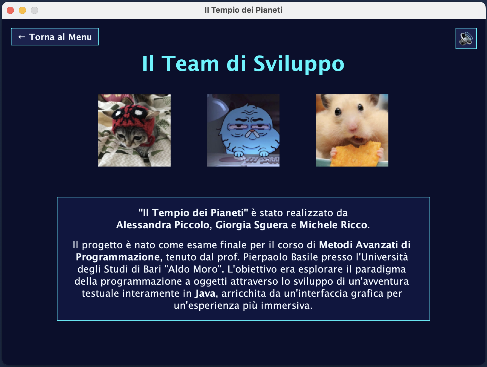
</p>

La classe `CreditsGUI` gestisce la schermata dei riconoscimenti, estendendo `JPanel` e contenendo tutti gli elementi grafici necessari per questa sezione, come mostrato di seguito:
```java
public class CreditsGUI extends JPanel {

    // costanti per uno stile grafico coerente in tutto il pannello
    private static final Color COLORE_SFONDO = new Color(10, 15, 45); 
    private static final Color COLORE_TESTO = new Color(240, 248, 255);
    private static final Color COLORE_ACCENTO = new Color(0, 246, 255);
    private static final Font FONT_TITOLO = new Font("Dialog", Font.BOLD, 34);
    
    private static JButton soundButton;

    /**
     * costruttore della classe CreditsGUI.
     * invoca il metodo per inizializzare e assemblare tutti i componenti grafici.
     */
    public CreditsGUI() {
        initComponents();
    }

    // ...
```
Il menù principale del gioco include un pulsante **?** che, quando premuto, apre una finestra di dialogo con le istruzioni per il gioco, come illustrato di seguito:
<p align="center">
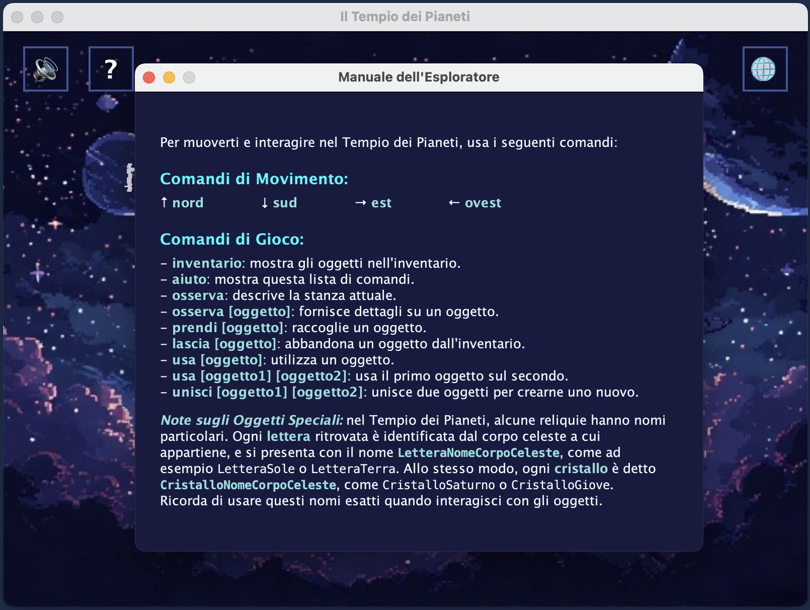
</p>

---

### Thread e Programmazione Concorrente

#### Cosa sono i Thread?

Un **Thread** rappresenta un singolo flusso di esecuzione all'interno di un programma, ovvero un processo che può operare in modo autonomo rispetto agli altri. In Java, i thread consentono di eseguire più operazioni contemporaneamente, migliorando l’efficienza e sfruttando al meglio le risorse hardware disponibili.

#### Creazione di un Thread in Java

Java mette a disposizione due metodi principali per creare un thread:

1. **Estendere la classe `Thread`**  
   In questo caso, si crea una sottoclasse di `Thread` e si sovrascrive il metodo `run()`, che contiene il codice da eseguire nel nuovo thread.

2. **Implementare l’interfaccia `Runnable`**  
   Qui si crea una classe che implementa `Runnable` e definisce il metodo `run()`. Successivamente, si passa un’istanza di questa classe a un oggetto `Thread`.

#### Avvio e gestione del Thread

Per far partire un thread, è necessario chiamare il metodo `start()`, che avvia il thread e invoca il metodo `run()` in modo asincrono.

È possibile anche interrompere un thread tramite il metodo `interrupt()`, che invia un segnale di interruzione; questo segnale può essere rilevato e gestito all’interno del metodo `run()`.

Inoltre, il metodo `join()` consente di sospendere l’esecuzione del thread chiamante fino a quando il thread su cui viene invocato termina la sua esecuzione.

### Utilizzo dei Thread nel Progetto

Nel progetto, i thread sono stati utilizzati per gestire diverse funzionalità in parallelo, migliorando la fluidità e l’interattività del gioco. Le principali applicazioni sono:

- **Riproduzione della musica di sottofondo**
- **Funzionamento della ProgressBar**
- **Gestione dell’input da parte dell’utente**  
- **Controllo del timer di gioco**

#### Riproduzione della musica di sottofondo

La musica viene gestita tramite un thread dedicato, in modo che possa essere eseguita indipendentemente dal resto del programma. Questo permette di avviare, interrompere o cambiare la traccia musicale in qualunque momento, sia durante il menù principale sia nella schermata di gioco. 

La classe responsabile della gestione della musica è `Mixer`, che estende la classe `Thread`. Questa classe si occupa di caricare le tracce audio e di eseguirle in background, mantenendo l’esperienza utente fluida e continua.

```java
public class Mixer extends Thread {

    private static Clip[] clips;
    private static int currentClip;
    private static boolean running = true;
    private static HashMap<String, Integer> roomToClipIndex;
    private static Mixer instance;

    /**
     * costruttore della classe Mixer.
     */
    private Mixer() {
    // loadClip...
    // playEffect...
    }
}
```
Il metodo `loadClip` carica la musica dal percorso del file:
```java
private void loadClip(int index, String filePath) {
    try {
        File file = new File(filePath);
        AudioInputStream audioStream = AudioSystem.getAudioInputStream(file);
        clips[index] = AudioSystem.getClip();
        clips[index].open(audioStream);
    } catch (Exception e) {
        e.printStackTrace();
    }
}
```
Il metodo `playEffect` riproduce un effetto sonoro da file, senza interrompere la musica di sottofondo:
```java
public static void playEffect(String effect) {
    new Thread(() -> {
        try {
            File file = null;
            if (effect.equals("binding")) {
                file = new File("src/main/resources/audio/binding.wav");
            } else if (effect.equals("progressbar")) {
                file = new File("src/main/resources/audio/progressbar.wav");
            } else if (effect.equals("leaving")) {
                file = new File("src/main/resources/audio/leaving.wav");
            }
            if (file == null || !file.exists()) {
                System.err.println("effetto sonoro non trovato: " + effect);
                return;
            }
            AudioInputStream audioStream = AudioSystem.getAudioInputStream(file);
            Clip sfx = AudioSystem.getClip();
            sfx.open(audioStream);
            if (running) {
                if (effect.equals("binding")) {
                    sfx.start();
                    sfx.loop(0);
                } else if (effect.equals("progressbar")) {
                    sfx.start();
                    sfx.loop(2);
                } else if (effect.equals("leaving")) {
                    sfx.start();
                    sfx.loop(6);
                }
            }
        } catch (Exception e) {
            e.printStackTrace();
        }
    }).start();
}
```
#### Funzionamento della ProgressBar

Nel nostro progetto, la **ProgressBar** non è stata implementata creando un thread separato tramite l’estensione diretta della classe `Thread`. Al contrario, abbiamo utilizzato la classe `Timer` di Java, che è essa stessa un thread, per gestire il funzionamento della barra di progresso.

Questa classe si occupa di:

- Inizializzare i componenti grafici della ProgressBar
- Aggiungere i listener necessari per la gestione degli eventi
- Avviare e aggiornare la ProgressBar

Il metodo `startProgressBar` gestisce l’avvio della barra, incrementandone progressivamente il valore e aggiornandone il testo associato.
Quando la ProgressBar raggiunge il 100%, si ferma e visualizza il messaggio **"il tempio si è risvegliato !!"**.
Il metodo `setFinished` serve a impostare lo stato di completamento, consentendo di avviare il gioco non appena la barra è completa.
```java
public void startProgressBar() {
    // usa un timer per aggiornare la barra a intervalli regolari
    Timer timer = new Timer();
    TimerTask task = new TimerTask() {
        private int counter = 0;
        @Override
        public void run() {
            if (counter <= 100) {
                progressBar.setValue(counter);
                progressBarLabel.setText("INIZIALIZZAZIONE COSMICA... " + counter + "%");
                counter++;
            } else {
                // caricamento completato
                progressBarLabel.setText("IL TEMPIO SI È RISVEGLIATO !!");
                // attendi un breve istante prima di notificare il completamento
                new Timer().schedule(new TimerTask() {
                    @Override
                    public void run() {
                        setFinished(true);
                    }
                }, 1000);
                // ferma il timer 
                timer.cancel();
            }
        }
    };
    // esegue il task ogni 35 millisecondi per un'animazione fluida
    timer.scheduleAtFixedRate(task, 0, 35);
}
```
#### Gestione dell'Input Utente

Per catturare l’input dell’utente, è stato creato un thread dedicato che monitora costantemente il campo di testo. Questo permette di rilevare e processare i comandi inseriti in modo rapido e indipendente dal resto dell’applicazione.

La classe responsabile di questa gestione è `UserInputManager`, la quale riceve i comandi dall’utente e li inoltra alla classe `UserInputFlow`, che si occupa di instradare correttamente i comandi all’interno del sistema.
```java
public static void startInputListener() {
    new Thread(() -> {
        while (true) {
            if (!isCurrentInputEmpty()) {
                UserInputFlow.gameFlow(getCurrentInput());
            }
            try {
                Thread.sleep(100); 
            } catch (InterruptedException e) {
                e.printStackTrace();
            }
        }
    }).start();
}
```
Questo codice si occupa di gestire l’ascolto continuo degli input forniti dall’utente. In particolare, il metodo `startInputListener` avvia un thread dedicato che monitora costantemente il campo di inserimento, permettendo di catturare immediatamente ogni comando immesso.

Oltre a questo, nel gioco sono stati creati altri thread per eseguire simultaneamente diversi compiti, come ad esempio:

- Preparazione degli elementi di gioco all’avvio di una nuova partita.
- Caricamento e setup degli elementi da un file di salvataggio.
- Esecuzione in background di un server REST.
- Gestione del timer di gioco tramite la classe `Timer`.
- Controllo del timer per il cambio dinamico dei pannelli di gioco.

L’utilizzo dei thread all’interno del gioco ha permesso di mantenere un’esperienza utente fluida e reattiva. Grazie a questa gestione, l’utente può interagire in modo naturale e coinvolgente con il gioco, senza percepire rallentamenti o interruzioni dovute a operazioni in background.

---

### Socket
#### Cosa sono i Socket?

In Java, i **socket** sono strumenti fondamentali per stabilire una connessione tra due dispositivi attraverso una rete. Si tratta di astrazioni software che rappresentano gli endpoint di una comunicazione bidirezionale tra due macchine.

Java utilizza un modello a **stream**, dove i dati vengono trasmessi attraverso flussi di input e output. In pratica:

- Un processo **scrive dati** nello stream di output del socket.
- L’altro processo **legge i dati** dallo stream di input associato.

#### Tipi di Socket in Java

Java fornisce due principali classi per lavorare con i socket:

- **`ServerSocket`**: usata dal lato server per mettersi in ascolto di richieste di connessione.
- **`Socket`**: usata dal lato client per iniziare la connessione verso un server.

Quando un client tenta di connettersi, il `ServerSocket` accetta la richiesta e restituisce un oggetto `Socket`, che può essere usato per inviare e ricevere dati.

#### Parametri di Connessione

- Quando si crea un **`ServerSocket`**, si specifica solo la **porta** su cui il server resta in ascolto.
- Per il **client**, invece, è necessario fornire sia l’**indirizzo IP** del server sia la **porta** a cui connettersi.

Nel nostro progetto, server e client risiedono sulla **stessa macchina**, quindi è stato sufficiente utilizzare la porta, senza specificare l’indirizzo IP.

### Utilizzo dei Socket nel Progetto

Nel menù principale del nostro gioco è presente un pulsante con l’icona **"🌐"**, che, se cliccato, apre una **pagina web** contenente:

- Le informazioni generali sul gioco  
- Le istruzioni per giocare  

Questa funzionalità è stata implementata utilizzando un **socket sulla porta 1111**. Stabilendo una connessione con il **browser predefinito** del sistema, viene caricata la pagina web locale desiderata.

#### Cosa contiene il sito web?

Il sito web fornisce: una panoramica del gioco e dei suoi obiettivi; le regole principali per giocare correttamente; informazioni utili all’utente, come controlli e suggerimenti; crediti e riferimenti.

<p align="center">

</p>

Il sito web associato al nostro gioco è stato progettato per fornire tutte le informazioni essenziali in modo chiaro e facilmente navigabile. Le sezioni principali includono:

- **Titolo del Gioco**  
  Il nome ufficiale del progetto: **"Il Tempio dei Pianeti"**.

- **Indice Linkato**  
  Un menù di navigazione interno che consente di saltare rapidamente alle varie sezioni della pagina.

- **Missione**  
  La descrizione generale del progetto e della trama dell'avventura.
  
- **Mappa**  
  La mappa del Tempio dei Pianeti, per facilitare gli spostamenti dell'utente all'interno del gioco.

- **Guida**  
  I comandi utilizzabili all'interno del gioco, con suggerimenti e altre informazioni utili.

- **Classifica**  
  Una classifica che mostra i tempi migliori raggiunti dagli utenti durante le partite.

- **Team**  
  Elenco dei membri del team di sviluppatori, con link ai loro profili GitHub e al repository del progetto.

#### Implementazione del Socket

Per rendere disponibile il sito web localmente tramite browser, è stato implementato un **server socket** all’interno del package `backend` del nostro progetto. Le classi contenute in questo package si occupano della gestione della comunicazione via socket, in particolare per l'apertura della pagina web.

Nel dettaglio, il socket:

- Rimane in ascolto sulla porta definita
- Risponde alle richieste HTTP in arrivo
- Fornisce in risposta il contenuto della pagina web (un file `.html`)
  
```java
/**
 * avvia il server.
 *
 * @throws IOException eccezione di input/output
 */
public void startServer() throws IOException {
    HttpServer server = HttpServer.createSimpleServer("/", 1111);
    ServerConfiguration config = server.getServerConfiguration();
    config.addHttpHandler(new DatabaseHandler(), "/api/data");

    StaticHttpHandler staticHandler = new StaticHttpHandler("src/main/resources/static/");
    config.addHttpHandler(staticHandler, "/");

    Runtime.getRuntime().addShutdownHook(new Thread(server::shutdownNow));

    new Thread(() -> {
        try {
            server.start();
        } catch (IOException e) {
            e.printStackTrace();
        }
    }).start();
}
```

All'interno del metodo `startServer()` viene creato un oggetto `HttpServer`, configurato per ascoltare sulla **porta 1111**. A questo server viene associato un **`HttpHandler`**, responsabile della gestione delle richieste HTTP in arrivo.

#### Gestione delle richieste GET
```java
private void handleGet(final Request request, final Response response) throws IOException {
    response.setContentType("text/html; charset=UTF-8");

    // costruisce dinamicamente le righe della tabella della classifica
    StringBuilder classificaRows = new StringBuilder();
    try (Connection conn = DriverManager.getConnection(DB_URL, DB_USER, DB_PASS);
         Statement stmt = conn.createStatement();
         ResultSet rs = stmt.executeQuery(DatabaseConnection.queryClassifica())) {
        
        while (rs.next()) {
            classificaRows.append("<tr>\n");
            classificaRows.append("<td>").append(rs.getString("USERNAME")).append("</td>\n");
            classificaRows.append("<td>").append(rs.getString("TEMPO")).append("</td>\n");
            classificaRows.append("<td>").append(rs.getString("FINALE")).append("</td>\n");
            classificaRows.append("</tr>\n");
        }

    } catch (SQLException e) {
        e.printStackTrace();
        classificaRows.append("<tr><td colspan='3'>errore nel caricamento della classifica.</td></tr>");
    }

    // uso un Text Block per l'HTML
    String htmlTemplate = """
        <!DOCTYPE html>
        ...
        %s
        ...
      """

    // inserisce le righe dinamiche nel template (al posto di %s) e invia la risposta
    Writer out = response.getWriter();
    out.write(String.format(htmlTemplate, classificaRows.toString()));
}
```
Il metodo `handleGet()` si occupa di processare le richieste HTTP di tipo **GET** ricevute sulla porta 1111. I passaggi principali sono:

- Impostazione del **content type** della risposta come `"text/html"`.
- Utilizzo di un oggetto `Writer` per generare dinamicamente il contenuto HTML della pagina web.
- Inserimento nel codice HTML dei dati recuperati dal **database**, che vengono mostrati all'interno di una tabella nella pagina (la classifica dei tempi di gioco, ordinati per finale ottenuto e tempo migliore).

#### Comunicazione Client-Server

La classe `Client` include la creazione di un oggetto `Socket` che effettua una **richiesta POST** verso il server. Questo consente di inviare al server i **dati relativi al tempo di gioco** di una partita appena conclusa.

I dati ricevuti vengono poi inseriti nel database, aggiornando così la classifica dei migliori tempi visibili anche nel sito web.

Grazie all’uso dei **socket**, è stato possibile:

- Offrire una **pagina web locale** accessibile direttamente dal gioco
- Visualizzare informazioni utili come regole, istruzioni e classifica
- Permettere agli utenti di **competere tra loro**, registrando e confrontando i tempi migliori

Questa integrazione ha migliorato l’esperienza dell’utente, combinando interattività, comunicazione in rete e interfaccia web in un’unica piattaforma.

---

### REST

#### Introduzione a Java REST
Nel contesto dello sviluppo di applicazioni distribuite, **Java REST** (Java Representational State Transfer) rappresenta un'architettura che consente lo scambio di dati utilizzando il protocollo **HTTP**.
Questa architettura è progettata per facilitare la comunicazione client-server, dove il client può interagire con risorse sul server tramite specifici metodi HTTP. Ogni metodo ha un ruolo ben preciso:
- **GET**: recupera risorse o dati dal server.
- **POST**: invia nuovi dati al server (ad esempio, per creare una nuova risorsa).
- **PUT**: aggiorna dati esistenti su una risorsa.
- **DELETE**: rimuove una risorsa dal server.

REST in Java è comunemente usato nella realizzazione di **API** che offrono un’interfaccia semplice, stateless e accessibile via web.

### Utilizzo di REST nel Progetto
Nel nostro progetto, abbiamo impiegato l’architettura Java REST per introdurre un livello di dinamismo negli enigmi presenti nelle varie stanze del gioco.  
Questa scelta ha permesso di rendere l’esperienza del giocatore più coinvolgente e meno statica.
In particolare, abbiamo simulato un'interazione **client-server** in locale, sfruttando lo scambio di dati tramite richieste REST per modificare il contenuto degli enigmi in tempo reale, offrendo così una maggiore varietà e imprevedibilità nel corso della partita.

#### Wordle
Per ottenere il cristallo della stanza di Nettuno, l'utente deve indovinare una parola segreta di 5 lettere. Questo enigma è stato implementato utilizzando la Java REST, in modo che l'utente possa ricevere una parola diversa ogni partita, rendendo il gioco più interessante e stimolante. Solo in caso di mancata connessione ad Internet è prevista una parola fissa di default ("COSMO"), in modo tale da permettere all'utente di completare comunque il minigioco.

L'API da noi utilizzata per generare le parole casuali è [Random Word API](https://random-word-api.herokuapp.com/home).

Tra le varie funzionalità offerte da questa API, quella di nostro interesse era la possibilità di ottenere una parola casuale di una lunghezza specifica. Per farlo, abbiamo utilizzato l’endpoint `/word` impostando il parametro `length=5`, così da ricevere una parola composta esattamente da 5 lettere.

L’endpoint `/languages` permette invece di visualizzare le lingue supportate per la generazione delle parole casuali. In questo caso, abbiamo specificato il parametro `lang=it` per ottenere parole in italiano.

Combinando i parametri, la richiesta da effettuare è la seguente:

```http request
https://random-word-api.herokuapp.com/word?lang=it&length=5
```

Questa API restituisce immediatamente una risposta in formato JSON, molto semplice e facile da interpretare. Un esempio di risposta è il seguente:

```json
["fuoco"]
```

Il JSON restituito è un array contenente un solo elemento: la parola casuale di 5 lettere in italiano. Data la sua semplicità, non è stato necessario ricorrere a librerie specifiche come Gson per il parsing; è stato sufficiente applicare una semplice sostituzione delle parentesi quadre e delle virgolette.

Qui sotto il codice utilizzato per eseguire la richiesta `GET` e per estrarre la parola dalla risposta:

```java
public class WordleGame {
    
    // ...
    
    // costanti e stato del gioco
    private static final int MAX_LETTERS = 5;
    private static final int MAX_ATTEMPTS = 5;
    
    private int currentAttempt = 0;
    private String wordToGuess;
    private boolean isGameOver = false;
    
    private static final String API_URL = "https://random-word-api.herokuapp.com/word?lang=it&length=5";
    private static final int TIMEOUT_MS = 5000;
    
    /**
     * inizializza una nuova partita, recuperando la parola dall'API.
     */
    public void initializeGame() {
        currentAttempt = 0;
        isGameOver = false;
        try {
            URI uri = new URI(API_URL);
            URL url = uri.toURL();
            HttpURLConnection conn = (HttpURLConnection) url.openConnection();
            conn.setRequestMethod("GET");
            conn.setConnectTimeout(TIMEOUT_MS); // stabilisce un limite di tempo per la richiesta di connessione iniziale con il server
            conn.setReadTimeout(TIMEOUT_MS); // stabilisce un limite di tempo per ricevere i dati dopo la connessione
            
            StringBuilder result = new StringBuilder();
            try (BufferedReader reader = new BufferedReader(new InputStreamReader(conn.getInputStream()))) {
                String line;
                while ((line = reader.readLine()) != null) { result.append(line); }
            }
            wordToGuess = result.toString()
                                .replace("[", "")
                                .replace("]", "")
                                .replace("\"", "")
                                .toUpperCase();
        } catch (Exception e) {
            System.err.println("errore API wordle, uso parola di default. causa: " + e.getMessage());
            wordToGuess = "COSMO";
        }
    }
    // ...
```

#### Trivia
Per ottenere il cristallo nella stanza di Urano, il giocatore deve rispondere correttamente a **tre domande consecutive**. Se commette un errore, il conteggio riparte da zero. Abbiamo introdotto una particolarità nel nostro minigioco: una **logica inversa**. In pratica, quando la risposta corretta sarebbe "vero", il giocatore deve invece scrivere "falso" per poter avanzare, e viceversa.

Per realizzare questa funzionalità abbiamo utilizzato delle API REST in Java, cercando un database che fornisse domande suddivise per categorie e livelli di difficoltà.

La soluzione che abbiamo ritenuto più adatta è stata l’uso di [Open Trivia Database](https://opentdb.com/), un database open-source dedicato alle domande di trivia. Questo servizio offre un’ampia scelta di quesiti, suddivisi per categorie e difficoltà.

Dal sito, cliccando sulla sezione **API**, abbiamo identificato l’interfaccia più utile per le nostre esigenze, ovvero la richiesta di domande filtrate secondo determinati parametri.

I parametri utilizzati nella richiesta sono stati i seguenti:

- **amount**: il numero di domande da ottenere, nel nostro caso `1` per volta.
- **category**: l’ID della categoria delle domande; abbiamo scelto "Science & Nature", per ottenere domande a tema scienza e natura.
- **difficulty**: il livello di difficoltà; abbiamo scelto `easy` per mantenere il gioco bilanciato, considerando la difficoltà della prova.
- **type**: il tipo di domanda; abbiamo selezionato `boolean`, che implica risposte vero/falso.
- **encode**: il tipo di encoding delle risposte; abbiamo lasciato il valore di default per non complicare inutilmente la richiesta.

Infine, tramite il pulsante **"Generate API URL"** offerto dal sito, abbiamo ottenuto il link necessario per effettuare la richiesta, configurato secondo i parametri scelti.

```http request
https://opentdb.com/api.php?amount=1&category=17&difficulty=easy&type=boolean
```

Una volta compreso il funzionamento dell’API, abbiamo integrato la richiesta all’interno del nostro codice Java tramite una chiamata **GET**, come mostrato di seguito:

```java
/**
 * recupera una nuova domanda e risposta dall'API e la mostra al giocatore.
 * tenta più volte prima di arrendersi.
 */
public void getNewQuestion() {
    for (int attempt = 0; attempt < MAX_ATTEMPTS; attempt++) {
        try {
            URI uri = new URI(API_URL);
            URL url = uri.toURL();
            HttpURLConnection conn = (HttpURLConnection) url.openConnection();
            conn.setRequestMethod("GET");
            conn.setConnectTimeout(TIMEOUT_MS); // stabilisce un limite di tempo per la richiesta di connessione iniziale con il server
            conn.setReadTimeout(TIMEOUT_MS); // stabilisce un limite di tempo per ricevere i dati dopo la connessione

            StringBuilder result = new StringBuilder();
            try (BufferedReader reader = new BufferedReader(new InputStreamReader(conn.getInputStream()))) {
                String line;
                while ((line = reader.readLine()) != null) {
                    result.append(line);
                }
            }

            if (parseAPIResponse(result.toString())) {
                displayQuestion();
                return; // successo, esce dal ciclo e dal metodo
            }
        } catch (IOException | URISyntaxException e) {
            System.err.println("tentativo " + (attempt + 1) + " fallito nel contattare l'API: " + e.getMessage());
        }
    }
    // se tutti i tentativi falliscono (es. il computer non ha internet, o il sito dell'API è temporaneamente irraggiungibile)
    OutputDisplayManager.displayText("> Una voce incorporea sussurra nella tua mente...\n“The cosmic winds are troubled. The ancient knowledge cannot reach me now. Return when the ether is calm.”");
    UserInputFlow.event = 0;
}

/**
 * esegue il parsing della risposta JSON dall'API in modo sicuro.
 * 
 * @param jsonResponse la stringa JSON di risposta
 * @return true se il parsing ha successo, false altrimenti
 */
private boolean parseAPIResponse(String jsonResponse) {
    try {
        JsonObject root = JsonParser.parseString(jsonResponse).getAsJsonObject();
        if (root.has("results") && !root.get("results").getAsJsonArray().isEmpty()) {
            JsonObject questionData = root.get("results").getAsJsonArray().get(0).getAsJsonObject();
            
            JsonElement questionElem = questionData.get("question");
            JsonElement answerElem = questionData.get("correct_answer");

            if (questionElem != null && !questionElem.isJsonNull() && answerElem != null && !answerElem.isJsonNull()) {
                this.currentQuestion = cleanHtmlString(questionElem.getAsString());
                this.correctAnswerFromAPI = answerElem.getAsString();
                return true;
            }
        }
    } catch (Exception e) {
        System.err.println("errore nel parsing della risposta JSON: " + e.getMessage());
    }
    return false;
}

// ...

/**
 * mostra la domanda al giocatore.
 */
private void displayQuestion() {
    OutputDisplayManager.displayText("> Antichi glifi si illuminano sul muro, formando una domanda nella tua mente:\n“" + currentQuestion + "”");
    OutputDisplayManager.displayText("> vero o falso? ");
}

/**
 * pulisce una stringa da entità HTML comuni.
 * 
 * @param text la stringa da pulire
 * @return la stringa pulita
 */
private String cleanHtmlString(String text) {
    return text.replace("&quot;", "\"")
                .replace("&deg;", "°")
                .replace("&amp;", "&")
                .replace("&apos;", "'")
                .replace("&lt;", "<")
                .replace("&gt;", ">")
                .replace("&#039;", "'")
                .replace("&eacute;", "é")
                .replace("&egrave;", "è");
}
```
Come si può osservare dal codice, la richiesta viene eseguita all’interno di un ciclo **for**. Questa scelta è dovuta al fatto che l’API non sempre restituiva una risposta valida al primo tentativo. Per questo motivo, abbiamo deciso di ripetere la richiesta più volte fino a ottenere una domanda valida, poi salvata nella variabile `currentQuestion`. Se dopo tre tentativi non si riesce ad ottenere una risposta dall'API, il minigioco si chiude con un messaggio di errore. Questa situazione si verifica anche in caso di mancata connessione ad Internet, per cui in questo caso diventa impossibile ottenere il CristalloUrano.

La risposta corretta fornita dall’API viene invece estratta e salvata nella variabile `correctAnswerFromAPI`. Entrambe queste informazioni verranno poi utilizzate per mostrare la domanda all’utente e verificare la correttezza della risposta.

Per implementare la logica delle **"risposte al contrario"**, la risposta inserita dall’utente viene confrontata con quella corretta ottenuta dall’API, dopo averne interpretato l'intento. In questo modo, è possibile definire se la risposta fornita dall'utente è quella corretta (ossia opposta a quella dell'API) oppure errata.

```java
/**
 * controlla la risposta del giocatore.
 *
 * @param playerInput l'input testuale del giocatore
 */
public void checkGuess(String playerInput) {
    PlayerIntent intent = getPlayerIntent(playerInput.toLowerCase());

    if (intent == PlayerIntent.INVALID) {
        OutputDisplayManager.displayText("> La voce riecheggia, irritata...\n“Your answer is meaningless. Focus. True, or false?”");
        return;
    }

    // logica della risposta invertita
    boolean playerFinalAnswer = (intent == PlayerIntent.SAID_TRUE) ? false : true;
    boolean correctAnswer = "true".equalsIgnoreCase(correctAnswerFromAPI); // il boolean è true se la risposta giusta è "true"

    if (playerFinalAnswer == correctAnswer) {
        handleCorrectAnswer();
    } else {
        handleWrongAnswer();
    }
}
```

#### Invio dei dati al server tramite Java REST
Un'altra funzionalità che abbiamo realizzato grazie all’uso della Java REST riguarda la trasmissione dei dati di gioco verso il server, ovvero il nostro database.  
Questo ci consente di registrare i tempi migliori raggiunti dai giocatori e mostrarli successivamente all’interno del sito web dedicato al gioco.
Per gestire questa funzionalità, all'interno del package `backend`, abbiamo implementato la classe `RestServer`.  
Questa classe ha il compito di avviare il server REST e di associare gli opportuni handler per rispondere alle richieste HTTP di tipo `GET` e `POST`, come illustrato di seguito:

```java
public class RestServer {

    /**
     * avvia il server.
     *
     * @throws IOException eccezione di input/output
     */
    public void startServer() throws IOException {
        HttpServer server = HttpServer.createSimpleServer("/", 1111);
        ServerConfiguration config = server.getServerConfiguration();
        config.addHttpHandler(new DatabaseHandler(), "/api/data");

        StaticHttpHandler staticHandler = new StaticHttpHandler("src/main/resources/static/");
        config.addHttpHandler(staticHandler, "/");

        Runtime.getRuntime().addShutdownHook(new Thread(server::shutdownNow));

        new Thread(() -> {
            try {
                server.start();
            } catch (IOException e) {
                e.printStackTrace();
            }
        }).start();
    }
}
```

#### Gestione delle richieste all'endpoint `/api/data`
La classe `DatabaseHandler` è stata progettata per occuparsi della gestione delle richieste HTTP di tipo `GET` e `POST` indirizzate all’endpoint `/api/data`.  
È in questa classe che viene implementata la logica per ricevere i dati inviati dal client o per fornire una risposta contenente i dati richiesti, come illustrato di seguito:

```java
public class DatabaseHandler extends HttpHandler {
    @Override
    public void service(final Request request, final Response response) throws Exception {
        if ("GET".equalsIgnoreCase(request.getMethod().toString())) {
            handleGet(request, response);
        } else if ("POST".equalsIgnoreCase(request.getMethod().toString())) {
            handlePost(request, response);
        } else {
            response.setStatus(405, "metodo non permesso");
        }
    }

    private void handleGet(final Request request, final Response response) throws IOException {
      response.setContentType("text/html; charset=UTF-8");
  
      // costruisce dinamicamente le righe della tabella della classifica
      StringBuilder classificaRows = new StringBuilder();
      //...
      }

    private void handlePost(final Request request, final Response response) throws IOException {
        String username = request.getParameter("username");
        String tempo = request.getParameter("tempo");
        String finale = request.getParameter("finale");

        // prepared statement 
        String sql = "INSERT INTO CLASSIFICA (USERNAME, TEMPO, FINALE) VALUES (?, ?, ?)";
        //...
```

La classe `DatabaseHandler`, che estende `HttpHandler`, è incaricata di gestire le richieste HTTP in arrivo sull’endpoint `/api/data`, adattando il comportamento in base al tipo di richiesta:
- **Per richieste GET**, viene eseguito il metodo `handleGet`, il quale interroga il database e restituisce i risultati da visualizzare sul sito.
- **Per richieste POST**, viene invocato il metodo `handlePost`, che inserisce nel database i dati ricevuti dalla richiesta.

Per eseguire correttamente una richiesta POST, è necessario un client HTTP. Nel nostro progetto, questo ruolo è ricoperto dalla classe `Client`, progettata come descritto di seguito:

```java
public class Client {
    public void sendPostRequest(final String nickname, final String time, final String finale) throws Exception {
        HttpClient client = HttpClient.newHttpClient();
        HttpRequest request = HttpRequest.newBuilder()
                .uri(URI.create("http://localhost:1111/api/data"))
                .header("Content-Type", "application/x-www-form-urlencoded")
                .POST(HttpRequest.BodyPublishers.ofString("username=" + nickname + "&tempo=" + time + "&finale=" + finale))
                .build();

        HttpResponse<String> response = client.send(request, HttpResponse.BodyHandlers.ofString());
        if (!(response.statusCode() == 200)) {
            System.err.println("errore durante l'invio dei dati: " + response.statusCode());
        }
    }
}
```        

#### Metodo `sendPostRequest` e design del client REST
Il metodo `sendPostRequest` della classe `Client` si occupa di inviare una richiesta HTTP di tipo **POST** all’endpoint `/api/data`. I dati trasmessi — come il **nickname**, il **tempo impiegato** e la **scelta finale** effettuata dall’utente — vengono poi registrati nel database.
All'interno della classe `Client` non è stato implementato alcun metodo per effettuare richieste GET. Questo perché nel contesto del nostro progetto, **l'unico vero server** attivo è rappresentato dal **REST Server**, che utilizza la libreria **Grizzly** per avviare un server HTTP completo. Tale server gestisce le richieste in ingresso tramite un apposito `Handler`, sia per i metodi GET che POST.

Il **database**, in questo caso, ha una funzione simulata: non serve a mostrare i dati direttamente all’utente tramite l’interfaccia web. L'obiettivo del progetto era infatti **visualizzare l’output HTML**, non interrogare il database in chiaro. Di conseguenza, una chiamata GET da parte del client sarebbe stata superflua, poiché non vi era alcuna necessità di ottenere dati testuali o strutturati — questi vengono già visualizzati lato web tramite la logica del server.

#### [Ritorna all'Indice](#indice)

---

## Javadoc
La documentazione Javadoc del progetto è disponibile qui: [javadoc](javadoc/index.html).
#### [Ritorna all'Indice](#indice)

---

## Soluzione del Gioco

<details>
  <summary>Per chi ha mollato. (clicca qui)</summary>
 <br> La mappa del gioco è la seguente: <br>
<br>
<p align="center">

</p>
<br> Le stanze possono essere visitate in qualsiasi ordine, eccetto per la Stanza della Luna alla quale per accedere è necessario disporre del bracciale completo dei cristalli di tutti i pianeti: il Bracciale Stellare.

---

### Stanza del Sole
<p align="center">

</p>

- `osserva` <br>
- `prendi Bracciale`

#### Per terminare il gioco
- `usa BraccialeVuoto su Nucleo` * <br>

---

### Stanza di Urano
<p align="center">
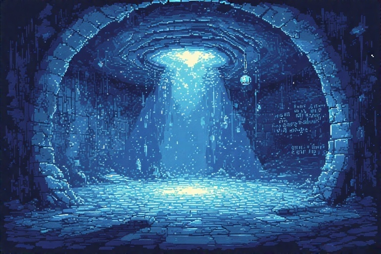
</p>

Prima `Nord` e poi `Est` dalla Stanza del Sole. <br>

#### All'interno della stanza:
- `osserva` 
- minigioco trivia: vero o falso al contrario (connessione a internet necessaria)
- `prendi CristalloUrano`
- `unisci BraccialeVuoto CristalloUrano` * 

--- 

### Stanza di Marte
<p align="center">
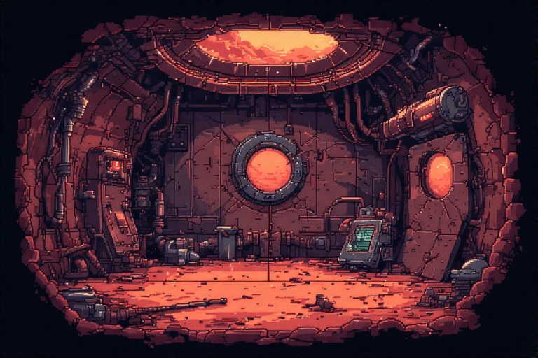
</p>

Prima `Nord` e poi `Ovest` dalla Stanza del Sole. Per sbloccare il cristallo di questa stanza è necessario raccogliere la lama che si trova nella stanza tra Marte e Urano con i comandi:
- `osserva` <br>
- `prendi Lama`

#### All'interno della stanza:
- `osserva` 
- `prendi Bastone`
- `unisci Bastone Lama` / `usa Lama su Bastone`
- `usa BastoneAffilato Portone`
- `prendi CristalloMarte`
- `unisci BraccialeVuoto CristalloMarte` *

--- 

### Stanza di Venere
<p align="center">

</p>

Prima `Sud` e poi `Est` dalla Stanza del Sole. Per sbloccare il cristallo di questa stanza è necessario raccogliere il panno e la corda che si trovano nella stanza tra Venere e Mercurio con i comandi:
- `osserva` <br>
- `prendi Panno`
- `prendi Corda`

#### All'interno della stanza:
- `osserva`
- `unisci Corda Panno`
- `usa Mascherina`
- `prendi CristalloVenere`
- `unisci BraccialeVuoto CristalloVenere` *

---

### Stanza di Mercurio
<p align="center">

</p>

Prima `Sud` e poi `Ovest` dalla Stanza del Sole. <br>

#### All'interno della stanza:
- `osserva`
- minigioco costellazione: 'Orione', 'Pegaso'
- `prendi CristalloMercurio`
- `unisci BraccialeVuoto CristalloMercurio` *

---

### Stanza di Giove
<p align="center">

</p>

Prima `Ovest` e poi `Nord` dalla Stanza del Sole. Per sbloccare il cristallo di questa stanza è necessario raccogliere il grano che si trova nella stanza tra Giove, Saturno e Nettuno con i comandi:
- `osserva` <br>
- `prendi Grano`

#### All'interno della stanza:
- `osserva`
- `usa Grano`
- `prendi CristalloGiove`
- `unisci BraccialeVuoto CristalloGiove` *

---

### Stanza di Saturno
<p align="center">
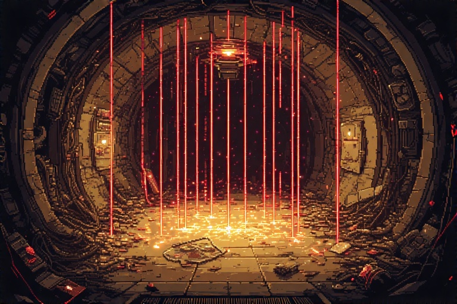
</p>

Prima `Ovest` e poi `Ovest` dalla Stanza del Sole.

#### All'interno della stanza:
- `osserva`
- `prendi Specchio`
- `usa Specchio`
- `prendi CristalloSaturno`
- `unisci BraccialeVuoto CristalloSaturno` *

---

### Stanza di Nettuno
<p align="center">
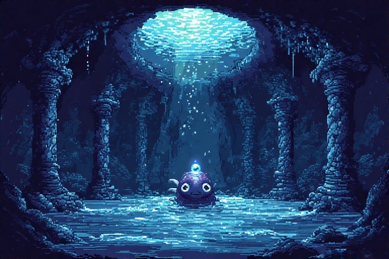
</p>

Prima `Ovest` e poi `Sud` dalla Stanza del Sole.

#### All'interno della stanza:
- `osserva`
- minigioco wordle
- `prendi CristalloNettuno`
- `unisci BraccialeVuoto CristalloNettuno` *

---

### Stanza della Terra
<p align="center">
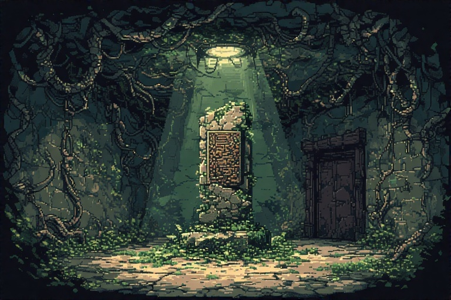
</p>

`Est` dalla Stanza del Sole.

#### All'interno della stanza:
- `osserva`
- `osserva Totem`
- minigioco proverbio: 'chi semina vento raccoglie tempesta'
- `prendi CristalloTerra`
- `unisci BraccialeVuoto CristalloTerra` *

---

### Stanza della Luna
<p align="center">
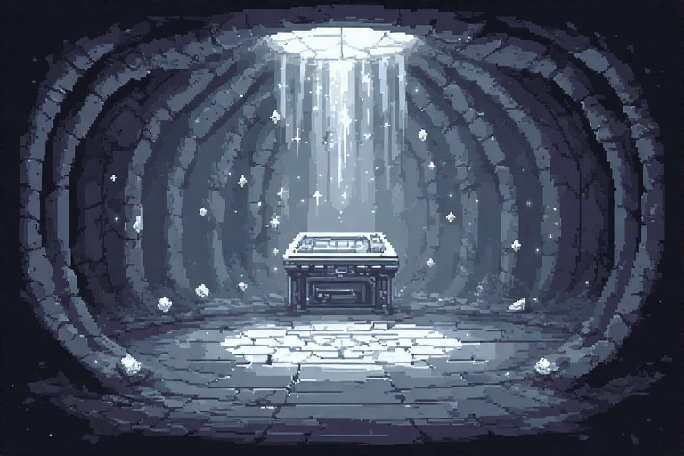
</p>

Prima `Est` e poi `Est` dalla Stanza del Sole. Si può accedere alla stanza solo se si dispone del BraccialeStellare (il bracciale completo di tutti gli altri cristalli). Per sbloccare il CristalloLuna è necessario comporre la frase che si ottiene ordinando le parole in maiuscolo contenute nelle lettere di ogni pianeta (dopo aver completato ogni stanza, è possibile leggere la relativa lettera attraverso il comando `leggi Lettera<NomeCorpoCeleste>`; le lettere si possono prendere e tenere nell'inventario per poterle leggere ovunque, altrimenti è possibile leggerle soltanto nella stanza a cui appartengono).

#### All'interno della stanza:
- `osserva`
- `osserva terminale`
- minigioco: 'il bracciale del viandante risveglia l'eco della luce dimenticata'
- `prendi CristalloLuna`
- `unisci BraccialeStellare CristalloLuna`

---

\* Dato che non c'è un ordine per visitare le stanze, in alternativa a `BraccialeVuoto`, può essere usato anche il `BraccialeLucente`, `BraccialeIntarsiato`, `BraccialeArmonico`, `BraccialeRisonante`, `BraccialeIncantato`, `BraccialeSplendente`, `BraccialeCeleste`, `BraccialeStellare`, `BraccialeLunare` a seconda del numero cristalli di cui il bracciale dispone. <br>

In base al numero di cristalli uniti al bracciale, il gioco terminerà con uno dei seguenti quattro finali:
- 0 cristalli, Oblio Totale
- da 1 a 7 cristalli, Parziale Salvezza 
- 8 cristalli, Rinascita Stellare
- 9 cristalli, Risveglio Cosmico

Ora tocca a te: riuscirai ad entrare nell’albo degli eroi cosmici e scoprire il destino dell'universo?

</details>

#### [Ritorna all'Indice](#indice)

---

## Conclusioni
Il progetto ci ha permesso di applicare in modo concreto le conoscenze acquisite durante il corso, affrontando sfide reali e sviluppando soluzioni efficaci.

L’esperienza è stata formativa sia dal punto di vista tecnico che personale: abbiamo lavorato in squadra, gestito le difficoltà e organizzato le attività in modo collaborativo.

Siamo soddisfatti del risultato raggiunto e riteniamo che il gioco rappresenti al meglio l’impegno e le competenze che abbiamo messo in campo. Ci auguriamo che l’utente finale possa apprezzare il lavoro svolto e trarne un’esperienza positiva.

#### [Ritorna all'Indice](#indice)
